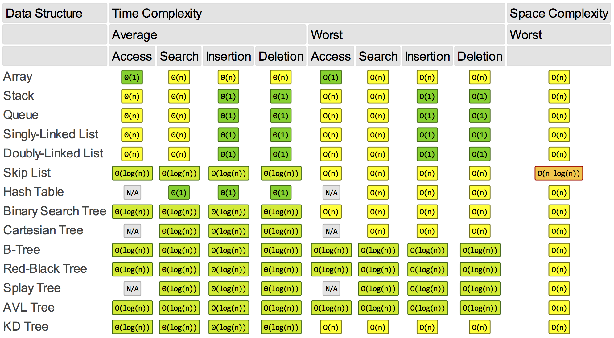

This is an overview of the time and space complexities of the most common sorting algorithms and operations on the most common data structures.

The figures are taken from <http://bigocheatsheet.com/>, and they contain the same information as the official [Big-O Cheat Sheet Poster](https://www.redbubble.com/people/immortalloom/works/22929408-official-big-o-cheat-sheet-poster?p=poster&SSAID=389818&utm_source=shareasale&utm_medium=affiliates&utm_campaign=banner).

# Sorting Algorithms

[PDF version](assets/complexities-sort-algo.pdf)

{:width="65%" .center-image}

# Data Structure Operations

[PDF version](assets/complexities-data-struct.pdf)

{:width="100%"}

