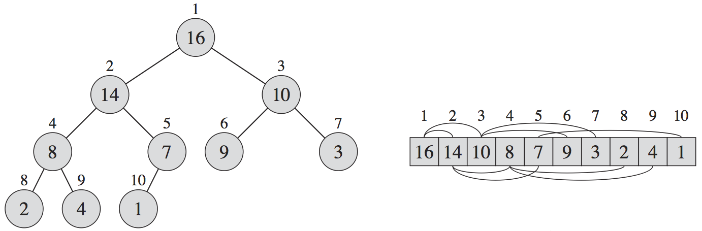

Overview of the most important data structures.

# Contents

- TOC
{:toc .toc-depth-1 .toc-skip-first}

# Binary Heap

{:width="50%" .center-image}

## Max-Heap

- The key of every node is **larger than or equal to** the keys of its **children**
- Consequently, the key of every node is **less than or equal to** the key of its **parent**
- Moving **up** from any node yields a **non-decreasing** sequence of keys
- Moving **down** from any node yields a **non-increasing** sequence of keys
- The node with the **largest** key is at the **root**

## Min-Heap

Idem max-heap, but with comparison relation inversed.

## Representation

A binary heap can be represented as an array to get rid of the need for pointers (which use precious space).

The "pointers" are implicit in the array indices, as follows:

{:width="100%"}

- Index 0 of array is left empty
- Root (depth 0) is at **index 1**
- Nodes on depth 1 are at **indices 2, 3**
- Nodes on depth 2 are at **indices 4, 5, 6, 7**
- Nodes on depth 3 are at **indices 8, 9, 10, 11, 12, 13, 14, 15**
- etc.

Thus, a binary heap of size $n$ can be represented as an array of size $n+1$ (the convention of leaving array index 0 empty is optional, but simplifies the pseudo-pointer arithmetic below).

### Pseudo-Pointer Arithmetic

Get depth of node given an index:

$$
\newcommand{\Log}{\text{log}}
\newcommand{\mr}[1]{\mathrm{#1}}
\mr{depth} = \left\lfloor\Log_2(\mr{index})\right\rfloor
$$

Get index of parent node (if any) given an index:

$$\mr{parent} = \left\lfloor\frac{\mr{index}}{2}\right\rfloor$$

Get indices of left and right children (if any) given an index:

$$\mr{leftChild} = 2 \times \mr{index}$$

$$\mr{rightChild} = (2 \times \mr{index}) + 1$$

### Note

It's possible to represent any binary tree in an array as shown above, so why we don't represent binary search trees (BST) as arrays?

Because for heaps, each level can be fully packed, and the length of the array to represent a binary tree with $k$ levels is around $2^k$. A heap of size $n$ has $\left\lceil\Log\, n\right\rceil$ levels, and thus requires an array of length $2^{\left\lceil\Log\, n\right\rceil}$.

However, for an unbalanced BST, the levels cannot be fully packed, because there is no flexibility for the position of the nodes. In the worst case, a BST of size $n$ has $n$ levels, and thus requires an array of length $2^n$.

## Applications

- Used to implement the **priority queue** data type
- Used for the **heapsort** sorting algorithm

# Binary Search Tree

{:width="50%" .center-image}

# Stack vs. Queue vs. Priority Queue

All of them have an **insert** operation, which adds a new value to the data type:

- Stack: *push*
- Queue: *enqueue*
- Priority queue: *enqueue*

All of them have a **remove** operation, which removes a value from the data type:

- Stack: *remove newest* (called *pop*)
- Queue: *removed oldest* (called *dequeue*)
- Priority queue: *remove maximum* (called *dequeue*)

# Priority Queue

**Insert** items, **remove** the item with the highest/lowest key.

## Applications

- Discrete event simulator: the key is the event time
- Job scheduler: the key is the priority of a job waiting for execution
- Sorting problem: insert elements to be sorted in a priority queue with the key being the value for which to sort, then repeatedly remove the minimum element from the priority queue

Can be implemented with the **binary heap** data structure.

## Time Complexity

Depends on the implementation:

- Unsorted array implementation
    - Insert: $O(1)$
    - Remove min/max: $O(n)$
- Sorted array implementation
    - Insert: $O(n)$
    - Remove min/max: $O(1)$
- Binary heap implementation
    - Insert: $O(\Log \, n)$
    - Remove min/max: $O(\Log \, n)$

# Stack

**Insert** items, **remove** the newest item (most recently inserted).

## Time Complexity

- Insert (push): $O(1)$
- Remove (pop): $O(1)$

## Applications

- Reverse a list: push all items on a stack, and then pop them

# Queue

**Insert** items, **remove** the oldest item (least recently inserted).

## Time Complexity

- Insert (enqueue): $O(1)$
- Remove (dequeue): $O(1)$
