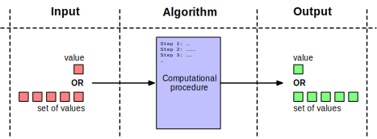

An algorithm is a **computational procedure** (sequence of steps) that takes a value, or set of values, as **input**, and produces a value, or set of values, as **output**.

{:width="100%"}

## Example: Sorting Algorithm

- **Input:** a sequence of $n$ numbers.
- **Output:** permutation of the input sequence so that the numbers are sorted.
