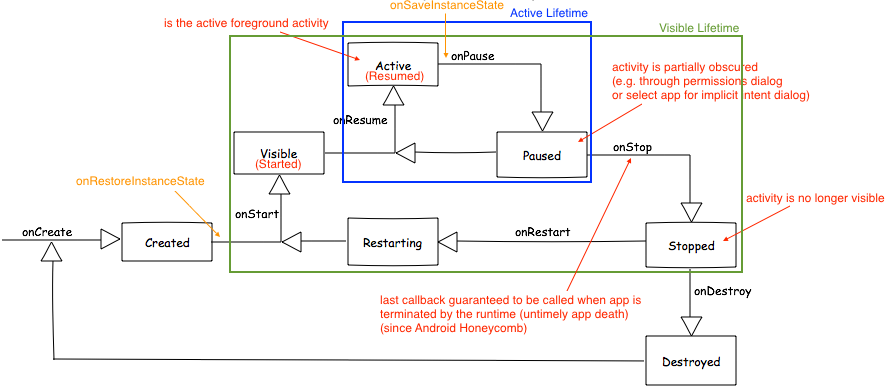
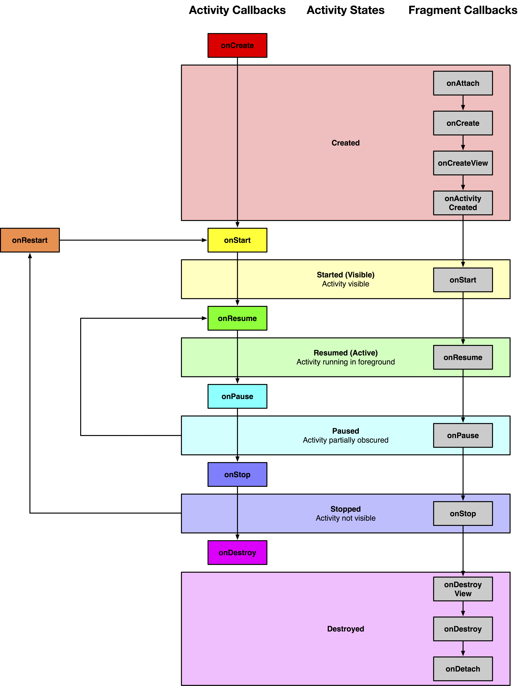

# Activity Lifecycle Summary

Link to [Android documentation](https://developer.android.com/training/basics/activity-lifecycle/index.html).

## Callback Sequence
`onCreate` > `onStart` > `onResume` > `onPause` > `onStop` > `onDestroy`

## Active Lifeteime

*Active* > `onPause` > *Paused* > `onResume` > *Active*

The *Paused* state is triggered when the activity gets *partially* obscured, for example, by a dialog.

## Visible Lifetime

*Active* > `onPause` > `onStop` > *Stopped* > `onRestart` > `onStart` > `onResume` > *Active*

The *Stopped* state is triggered when the user navigates away of this activity, that is, the activity is no longer visible.

# Visual Representation

{:width="100%"}

# Visual Representation Including Fragment Callbacks

{:width="100%"}
