# 1. Architecting Security and Governance Across your AWS Environment, Protected by an Integrated AWS Identity and Access Management

## Multi-account environments

- Different accounts for different purposes with different access rights, usage limits, etc.

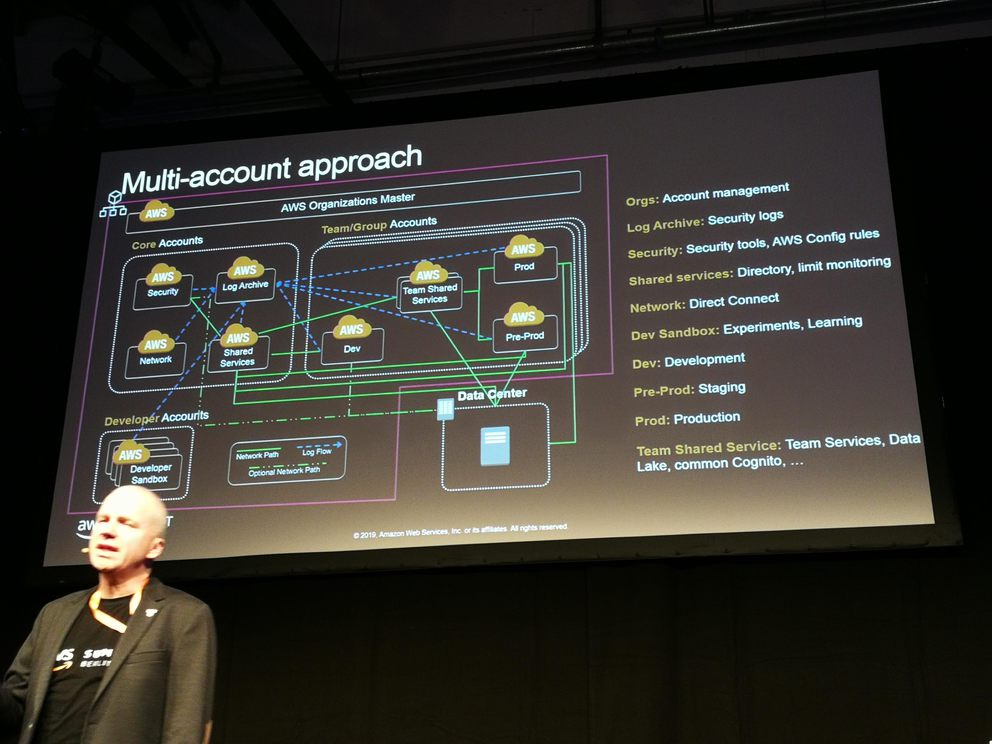-

- Every account should have the following services enabled: AWS CloudTrail, AWS Config, Amazon Guard Duty
- AWS Landing Zone
    - Automated setup of a multi-account environment (based on best practices)
    - Some services already set up in specific accounts
    - Account vending machine

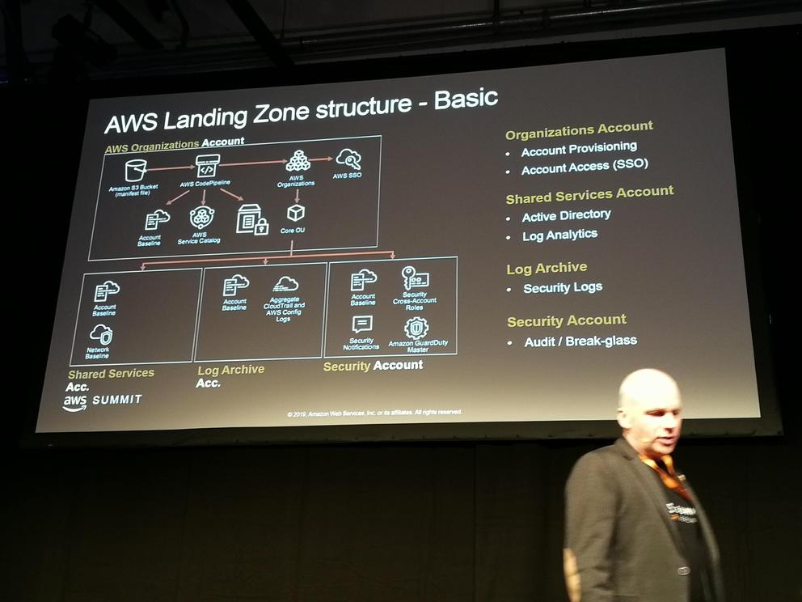

- AWS Control Tower (currently in preview)
    - Similar to AWS Landing Zone

## Access management in multi-account environment

- Service Control Policies (SCP) (vs. IAM policies)
- Assign SCPs to organizational units (OU)
- Manage access to AWS services) (vs. manage access to ARNs in IAM)
- By default, everything is allowed (vs. everything denied in IAM)
- Assigned to oganizational units or accounts (vs. roles and groups in IAM)

## Combine IAM policies and SCPs

- The effective permissions ar the intersections of all IAM policies and SCPs
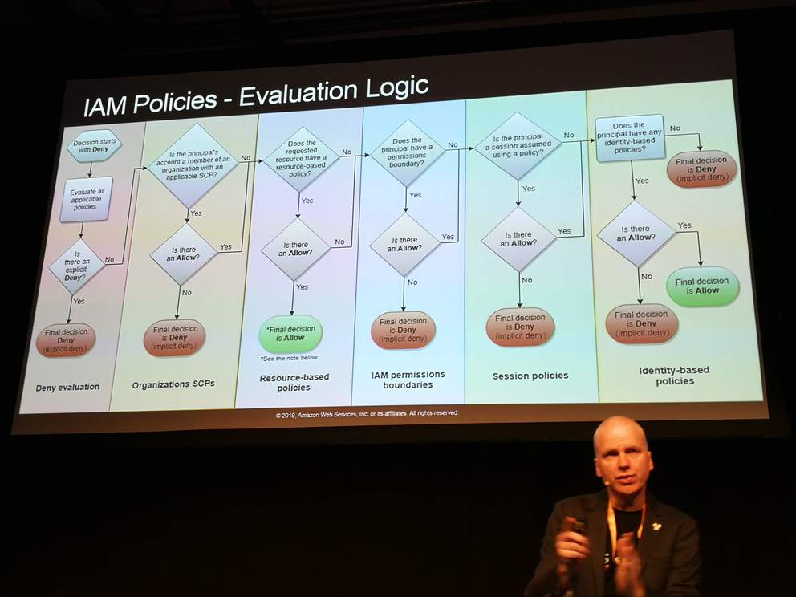

# 2. Cutting-Edge Architectures Based on AppSync, Lambda, and Fargate

## New AWS services for general-purpose applications since 2009

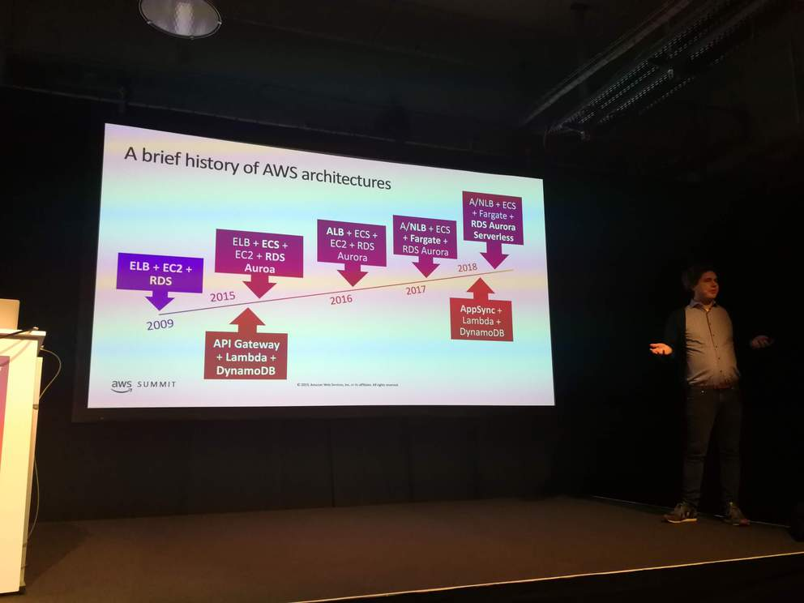

## Architecture 1: AppSync - Lambda - DynamoDB

- AppSync: like API Gateway, but for GraphQL APIs instead of REST APIs
    - Requires authorisation including Cognito, IAM, API keys, and Open ID Connect
    - Easier to use than API Gateway
    - GraphQL
        - Schemas for defining the API
        - Two main types of calls: Query and Mutation
        - Define types of all objects going through API
    - Connect data sources (e.g. DynamoDB, Lambda)

## Architecture 2: Application Load Balancer - Fargate - Aurora

- Fargate
    - Specify Docker image to run, and Fargate runs it
    - Allows auto-scaling of containers (replicas)
    - Part of ECS
    - Use it if it's not really necessary to used ECS or EKS (to avoid the heavy lifting associated with them)
    - Combine with CloudMap (service discovery)

## CI/CD

- Use Code Pipeline and CodeBuild to build code on push to GitHub repository and then deploy as changes to a CloudFormation template

# 3. From Idea to Customers: Developing Modern Cloud-Enabled Apps with AWS

- ReactNative translation app in 95 lines of code
    - Amplify, AppSync, Amazon Translate, Polly, S3
- GraphQL
    - Main objects: queries, mutations, subscriptions (real-time data pushed to subscribed clients)
    - Client specifies shape of response (no need to make multiple requests to get a specific set of data)
- AppSync
    - Managed GraphQL service
    - Real-time and offline capabilities
- Amplify
    - Create, read, update, and delete services for use in an application
    - Amplify CLI
        - Generates and applies CloudFormation templates
            - `amplify add <...>`: updates CloudFormation template
            - `amplify push`: applies CloudFormation template
    - JavaScript library
        - For accessing services created by Amplify CLI
    - Questions
        - Where can CloudFormation template generated by Amplify CLI be found? Can it be used without Amplify CLI?
- Amazon Pinpoint
    - Collect and analyses application usage metrics
    - Engage users with email, SMS, etc.
    - Agent code integrated into applications (can be done with Amplify)

# 4. Managing All Your Operations in One Tool

## Resource groups

- Part of AWS Systems Manager
- Create groups of resources within an application
- Specification of resources
    - Based on tags
    - Based on CloudFormation stacks (queries on CloudFormation stacks)
- Groups are dynamic (if tags or CloudFormation stacks are updated, resource groups are updated too)

## Where can resource groups be used?

- AWS Config
    - Create compliance rules on resource groups
    - View configuration changes in resource groups
- CloudTrail
    - Show all API calls in account
- AWS Personal Health Dashboard
    - See if failure is caused by application or AWS
- AWS Trusted Advisor
- Inventory
    - Part of AWS Systems Manager
- CloudWatch Dashboards
    - Filter based on resource groups
- Built-In Insights
    - Part of AWS Systems Manager

## Taking action on identified issues

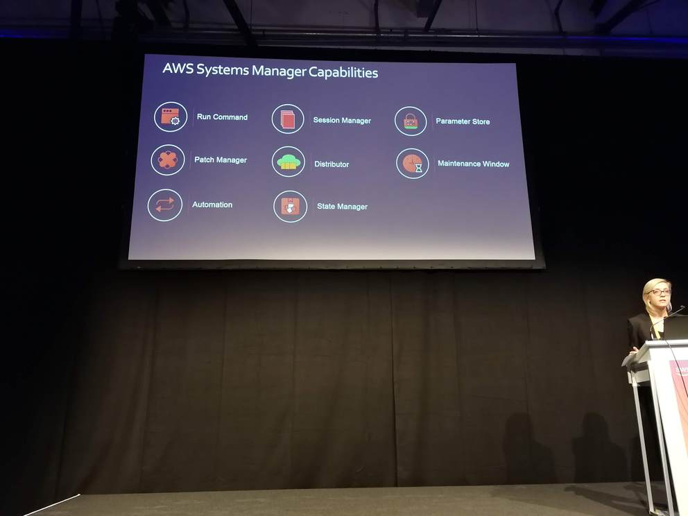

- AWS Systems Manager
    - Automation
        - Convert repetitive tasks into runbooks
    - Run Commands
        - Run commands on instances
    - Session Manager
        - Connect to instance without having to open TCP ports or installing SSH keys on the instances
    - State Manager
        - Enforce OS configurations on instances

# 5. Leveraging AWS Marketplace: Sell Your Application the Way Customers Want to Buy

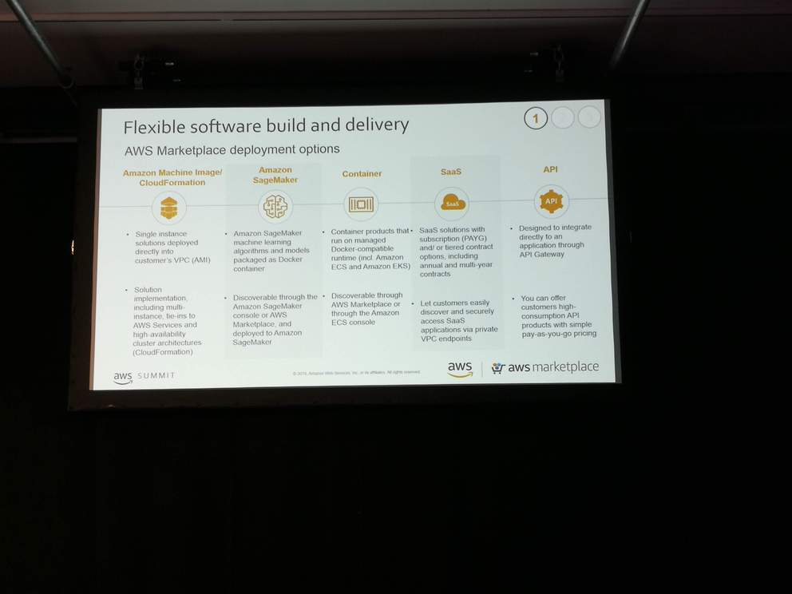

- Sell applications that buyers can install in their own AWS account (with a single click)
    - Alternative to on-premises software vendings
    - Not an alternative to SaaS solutions that run completely on the seller's infrastructure
- Delivery methods
    - AMI, Amazon SageMaker (new), container (new), SaaS, API
- Purchasing methods
    - Free trial, pay-as-you-go, monthly, yearly, etc.
- Provides standard legal terms, etc.

# 6. Full Stack in the Era of Serverless Computing

- What is serverless?
- Service-full
    - External services constitute the building blocks of a system
    - Try to use external services as much as possible
    - Codeless
- Merging of engineering roles

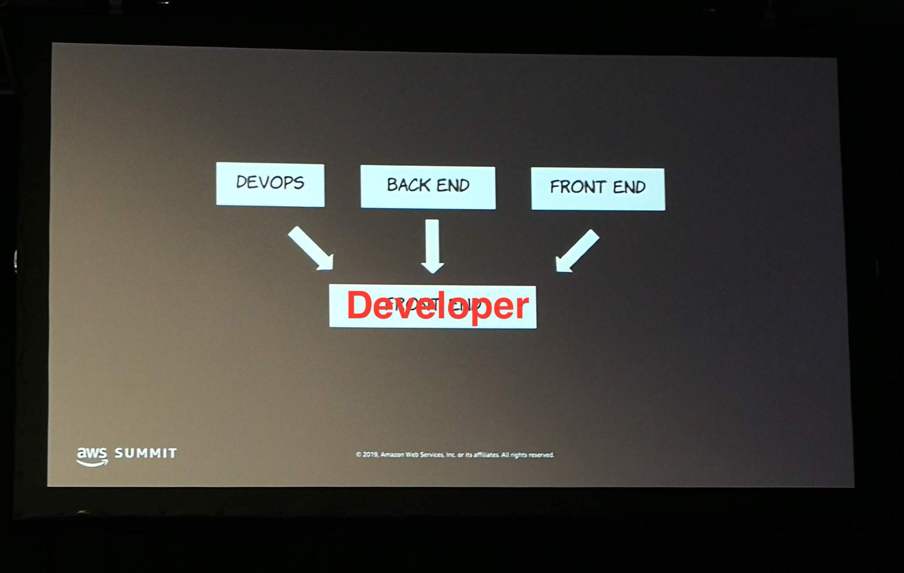

## Amplify

- Components
    - CLI
        - Configure and launch a set of services

          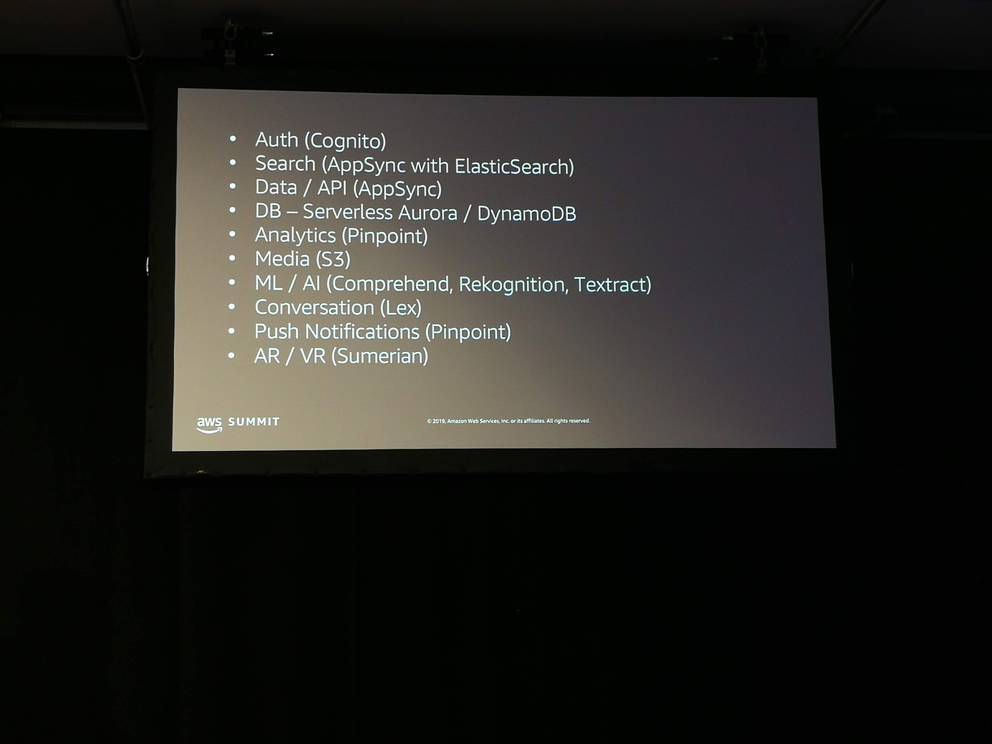

    - Client library
        - Interact with cloud services
        - Pre-configured components for popular front-end frameworks (Vue, Angular, React Native)
    - CI/CD
- Supports multiple environments, like dev, prod, etc. (new)
- Creates `amplify/backend` folder
    - Containing a sub-folder for each added service
- If using a GraphQL API (with AppSync), also cretes the local GraphQL objects (queries, mutations, subscriptions)

# 6. Extending EKS with Open-Source Tools

- AMI build scripts
- eksctl
    - By default puts all worker nodes in a public subnet (can be changed with `--node-private-networking`)
- Helm
    - Package repository of Kubernetes applications
    - Needs to install Tiller pod in cluster
        - `helm init`
    - Need to create servie account and cluster role for Tiller pod
    - When Tiller is installed, can install application with `helm install `
    - Helm chart may store passwords in a Kubernetes secret
- Pod-level permissions
    - By default pod inherit permissions of worker node instance role
        - All pods running on a host have the same permissiosn
    - Two tools for container-specific permissions: **kiam** and **kube2iam**
    - kube2iam runs a pod on each worker node (in kube-system namespace)
        - This pod configures iptables on the host
        - By default, denies any access to outside services
    - Specify pod permissions with annotations in the pod definitions (reference an IAM role)
    - Also possible to add this annotation to a namespace definition and every pod running in this namespace will inherit it
    - kube2iam requires an IAM role itself
    - Install kube2iam with Helm
- Cluster AutoScaler
    - Runs pod in the kube-system namespace
    - Automatically launches worker nodes (as well as pods)
- <https://gitlab.com/ric_harvey/bl_eks_opensource>

# 7. Microservices on AWS: Architectural Patterns and Best Practices

- Building blocks for a microservices architecture: ECS, EKS, Fargate, Lambda
- Decision diagram which service to use:

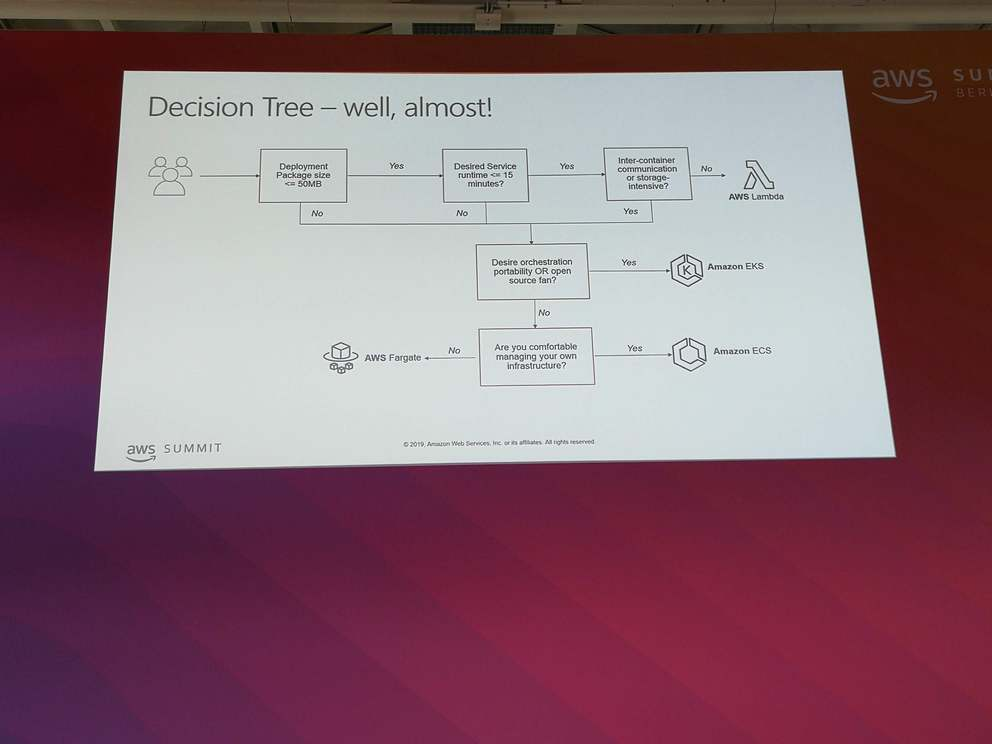

- Start with Lambda and only use containers if really needed

## Best practices

- Reduce size of Docker images
    - Use Busybox base image
    - Problem: each instruction in a Docker file adds a layer to the image
    - Use multi-stage Docker builds
        - Copy just parts of a previous stage to the target image in a the current stage     
- In Kubernetes, optimize pods
    - Avoid sidecar containers if possible
    - Use resource constraints in pod definitions (requests and limits)
- Lambda Layers
    - Upload code to Lambda and reference it from multiple Lambda functions
    - Lambda custom runtimes are implemented with Lambda Layers
- Lambda Container Image Converter
    - Convert Docker images to Lambda Layer (and upload it to Lambda)
    - <https://github.com/awslabs/aws-lambda-container-image-converter>

# 8. AWS Networking Advanced Concepts and New Capabilities

- Two account and VPC strategies
    - Few large accounts and VPCs
        - Key decisions: IAM (policies)
    - Many small accounts and VPCs
        - Key decisions: infrastructure and networking
- Multi VPC strategies
    - Subnets (public, private)
    - ACLs
    - Separate VPCs
- VPC Sharing: share subnets in a VPC with other accounts
    - Allows to use a separate account for managing all the networking infrastructure used by other accounts
- Shared Services: use a service in all VPCs
    - VPC peering (one-to-one connectivity)
    - AWS PrivateLink
    - Transit VPC
        - An additional VPC for routing traffic between VPCs
        - Requires EC2 instances (in Transit VPC)
    - API Transit Gateway
        - Connect VPCs to Transit Gateway so they can talk to each other
        - Connectivity can be fully configured with routing domains and routes
        - Transit Gateway can also be connected to VPN or AWS DirectConnect

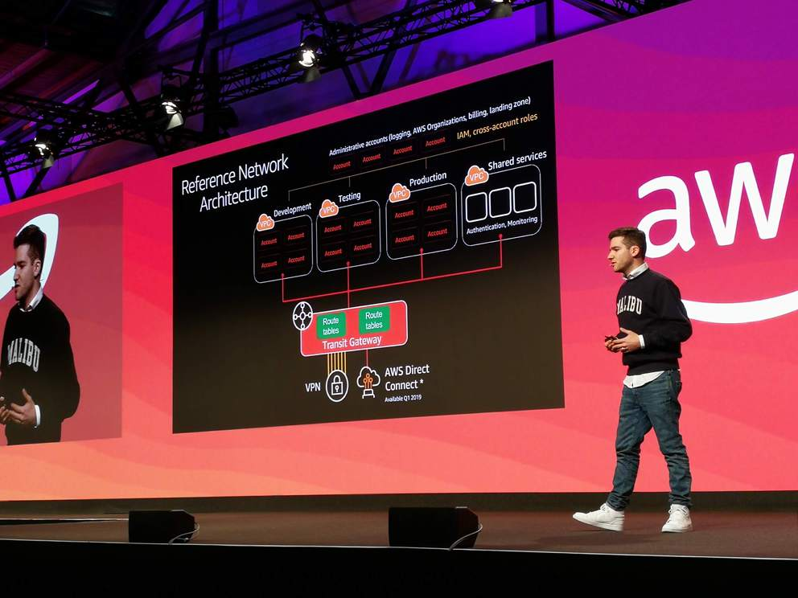
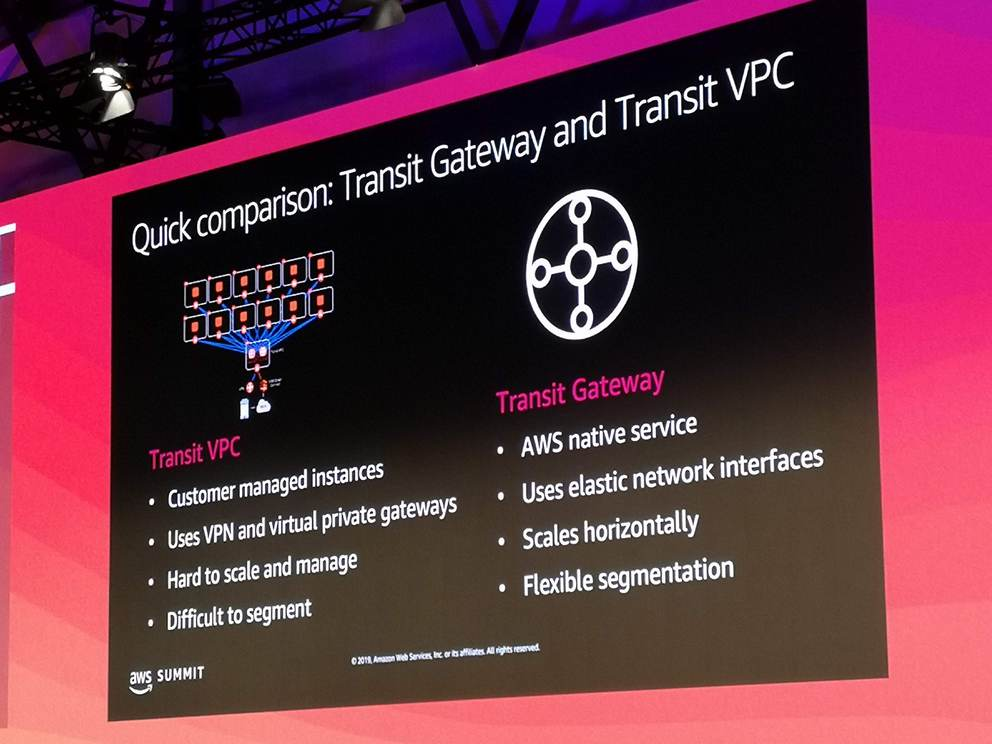

- AWS Global Accelerator
    - Like CloudFront, but for any type of applications (not just HTTP)
    - Provides single global IP, which routes traffice to application in nearest region

# 9. Handling Heterogeneous Container Clusters in AWS

- Computing infrastructure of Scout 24
- One separate AWS account (platform account) with an ECS cluster where all the services run
- Separate accounts for each product
    - Product accounts need to deploy serivces to platform account
    - CloudFormation stack triggering SNS message to topic of platform account

- Problems of having heterogenous services on an ECS cluster
    - Declared and effective CPU usage may conflict
    - CloudFormation not suited to deploy to ECS, use ECS API or CodeDeploy
    - ECS does not have as many tools as EKS
    - Kubernetes (EKS) handles heterogeneous workloads better

# 10. Boost your AWS Infrastructure

## Infrastructure as Code (IaC)

- Benefits of IaC
    - Automated, repeatable, versioned
- IaC approaches
    - Declarative: CloudFormation templates
    - Imperative: Cloud Development Kit (CDK), Troposphere, SparkleFormation, GoFomration
        - All these tools generate CloudFormation templates

## Cloud Development Kit (CDK)

- Currently in beta
- Components
    - Apps: executable programs that produce CloudFormation templates
    - Stacks: deployable units (corresponding to CloudFormation stacks)
    - Constructs: resources sets to be used as subsystems of a stack
        - Basic resources
        - AWS Construct Library (predefined resource sets on AWS service level following best practices)
        - Custom (resource sets that can be defined by user and reused)
- Command-line tool
    - `cdk init`
    - `cdk synthesize` (generate CloudFormation template)
    - `cdk deploy` (apply CloudFormation template)
- Library in different programming languages
    - Including AWS Construct Library
- <https://cdkworkshop.com>
- <https://github.com/awslabs/aws-cdk>

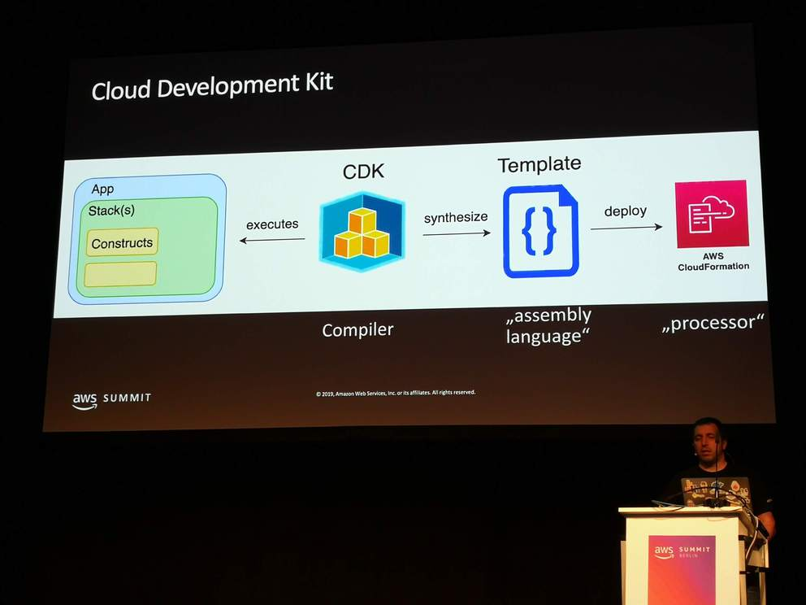

# 11. ECS Deep Dive

- ECS and Fargate
    - Containers get IP address from VPC (see below)
    - Containers can get their own IAM role (see below)
    - For service discovery, can use Route 53 DNS with ECS (not internal DNS like in Kubernetes)
    - Fargate is a part of ECS (runs on ECS)
- ECS automatically schedules containers to nodes in the cluster
    - Can be customised with parameters
    - ECS agent and ECS AMI on each cluster node (must be installed)
- For ECS, you must provision and set up the EC2 instances for the cluster
- The ECS control plane is managed by AWS and free
- Run workloads on ECS by defining *tasks* that consist of one or more containers
    - Works the same for Fargate
- Fargate networking
    - VPC networking mode: each task runs in its own subnet with its own Elastic Network Interface (ENI)
        - The VPC can be shared with other tasks and AWS services (e.g. Load Balancer)
        - ENI needs internet access (to pull container images)

- Fargate permissions
    - Cluster permission: define who can run tasks with IAM policies
    - Application permissions: reference IAM role from task definition
    - Can define permissions on container-level by specifying IAM roles in task definitions
- Fargate logging
    - Can define log configuration in task definition (for each container)
- <https://gitlab.com/ric_harveybl_practical_fargate>
