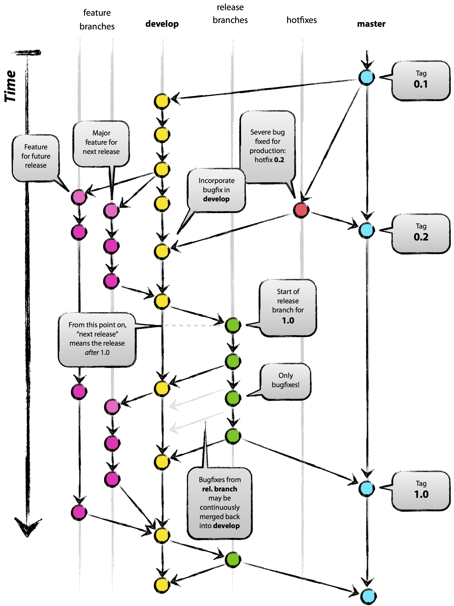

When multiple people collaborate on the same Git project, it is important to have a clear branching model in order to avoid a mess. Basically, a branching model clears up the following points:

- What branches exist?
- To which branches to commit?
- How and when to merge and delete branches?

There are many possible branching models, but a very popular one has been described by Vincent Driessen [here](http://nvie.com/posts/a-successful-git-branching-model/).

# The Model

Download the [PDF version](assets/branching-model.pdf).

{:width="100%"}

The main points of this model are the following:

- There are two persistent branches, the **master** branch and the **develop** branch.
- The **master** branch contains only **releases**. It is not touched until there is a release.
- The **develop** branch is used by the developers during development.
- However, the developers don't commit directly to the develop branch, but they create a temporary **feature branch** for every feature that they work on.
- When a feature is completed, the corresponding **feature branch** is **merged** back into the develop branch, and the feature branch is **deleted**.
- When it's time for a new release, a **release branch** is created from the develop branch.
- The release branch is used for **dotting the i's and crossing the t's** before the final release.
- When everything is ready, the **release branch** is **merged** into the master branch, and the release branch is **deleted**.

# git-flow

[git-flow](https://github.com/nvie/gitflow) is a collection of Git extensions that facilitate the application of the above branching model. It basically adds to `git` the `flow` command, and many sub-commands.

A very useful cheatsheet for the usage of git-flow exists [here](https://danielkummer.github.io/git-flow-cheatsheet/).
