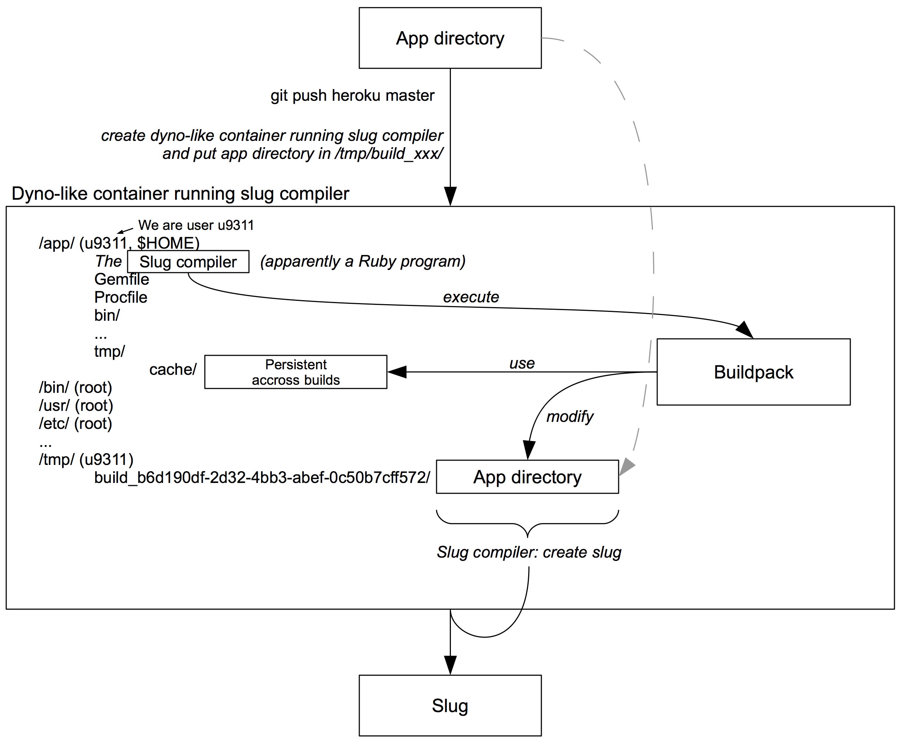

When deyploing a web application to Heroku (via `git push`), Heroku performs a *build* on a special *build dyno*. The following overview shows what's going on during such a build.

This is a zoom on the *Build* component in the wider overview of [How Heroku Works](how-heroku-works.html).

[PDF version](assets/heroku-build.png)

{:width="100%"}
