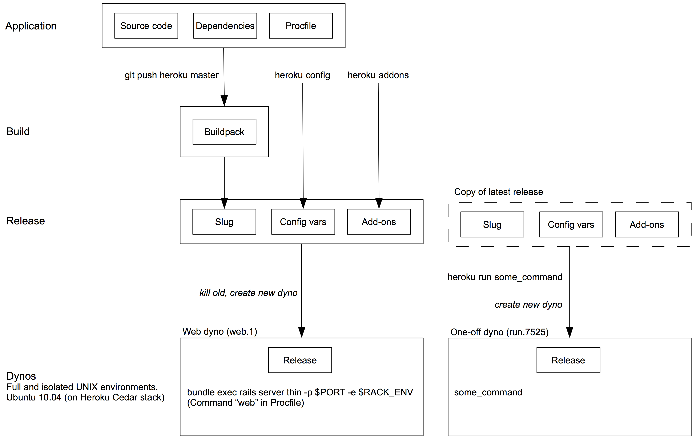

This is a coarse overview of how Heroku works: from the application **source** through the creation of **releases**, to the deployment of these releases on the **dynos**.

Details about the *Build* stage are presented in [What Happens During a Heroku Build](heroku-build.html).

[PDF version](assets/how-heroku-works.pdf)

{:width="100%"}
