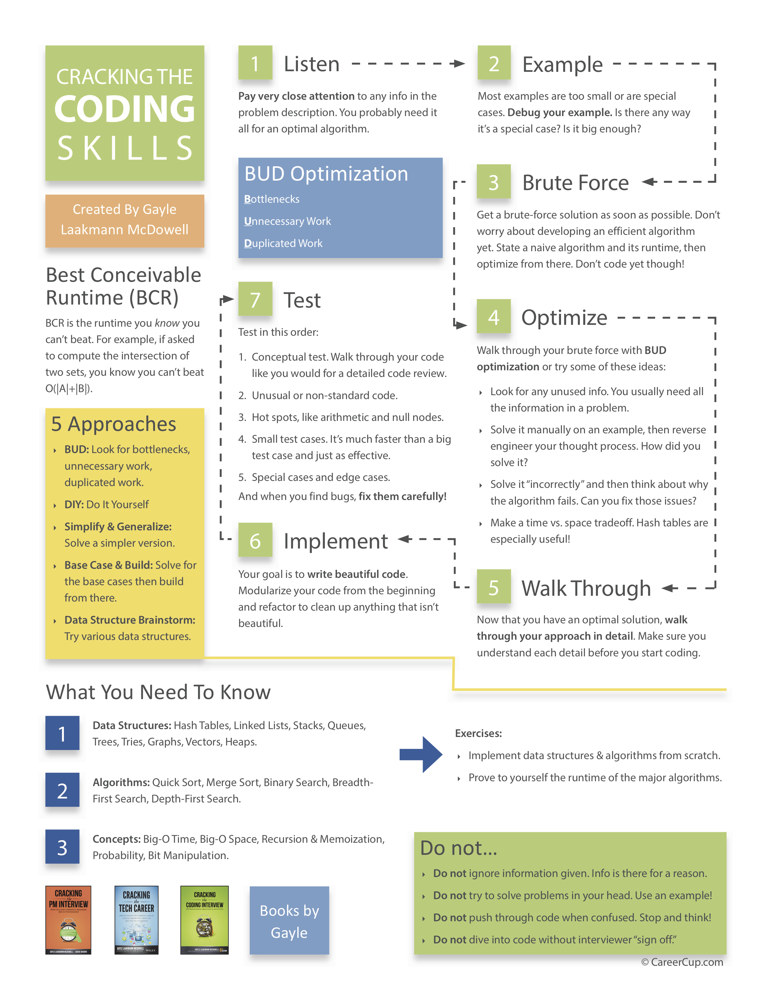
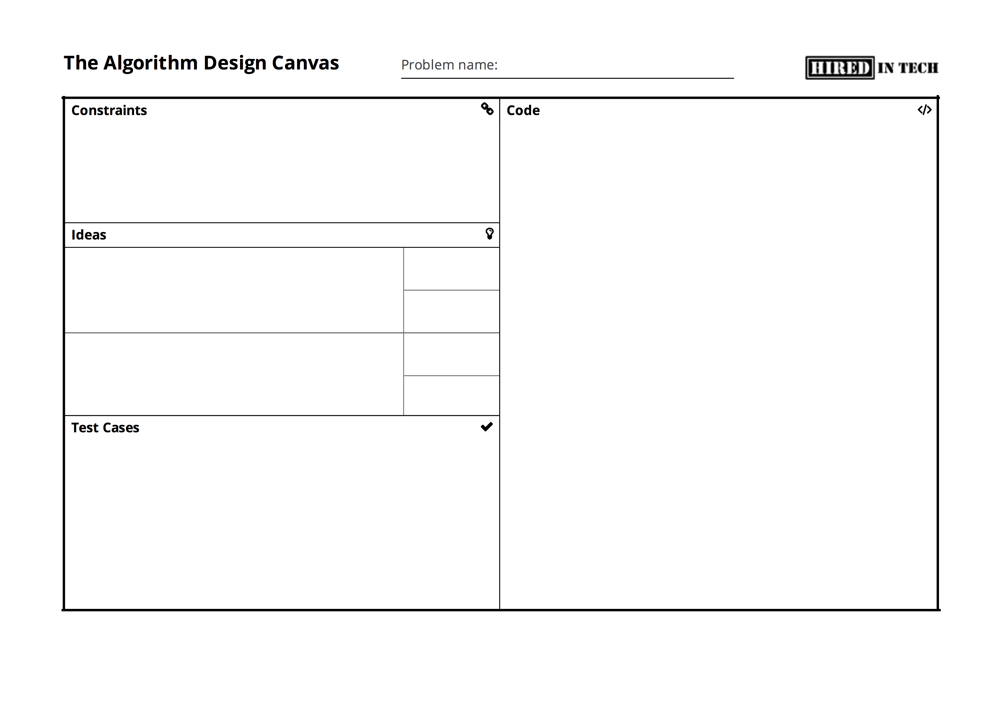

# 1. Ask for constraints and additional information

- Can there be floating point numbers or only integers?
- Can there be negative numbers? Zero?
- Are the numbers guaranteed to be sorted?
- Are there repeated elements?

# 2. Solve an instance of the problem manually

- The instance should be small enough to be solved manually, and big enough to see any patterns
- The instance should not be a special case
- This makes sure that you understand the question

# 3. Think about a brute force solution, if applicable

- Determine its **time and space complexity**

# 4. Gather ideas

- List everyting you know
- Are there any rules and patterns?
- Consider recursion
    - Top-down: can the problem for $n$ be trivially solved when the solution for $n-1$ is known? 
    - Bottom-up: start with a base case; if you know the solution for $n=1$, can you solve the problem for $n=2$? If you know the solution for $n$, can you solve the problem for $n+1$?

# 5. Optimise the current solution

- Look for BUD (Bottlenecks, Unnecessary Work, Duplicated Work)
- Solve an instance of the problem manually and "reverse engineer" the intuitive manual approach
- Consider different data structures and algorithms
    - E.g. hash table ($\text{O}(1)$ insert and delete), binary search ($\text{O}(\text{log}\,n)$), sorting ($\text{O}(n\,\text{log}\,n)$, etc.
- Goal: optimise **time and space complexity** by considering time vs. space tradeoffs
- Run new  solution through some small test cases to confirm that it works

# 6. Implement the solution

- Start with main method name, parameters, and return value
- Write *modularised* code, not *plain* code
    - That means, use method invocations instead of lengthy in-place code; you can implement the helper method later
- If necessary, use *TODO* comments

# 7. Test the implementation

- Run the implementation through small test cases
- Include edge cases: zero, negative numbers, empty string, empty list, etc.
- If you find a bug, fix it init in  the code

# Cheatsheet

[PDF version](assets/cracking-the-coding-skills.pdf)
{:width="100%"}
*Source:&nbsp;[crackingthecodinginterview.com](http://www.crackingthecodinginterview.com/resources.html)*{:.caption}

# Algorithm Design Canvas

A generic approach for solving any algorithm design question, as proposed by [HiredInTech](https://www.hiredintech.com/).

[PDF version](assets/algorithm-design-canvas.pdf)
{:width="100%"}
*Source:&nbsp;[hiredintech.com](https://www.hiredintech.com/classrooms/algorithm-design/lesson/78)*{:.caption}
