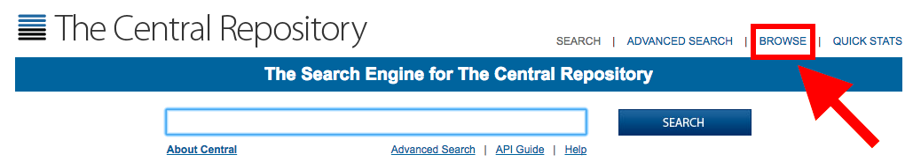
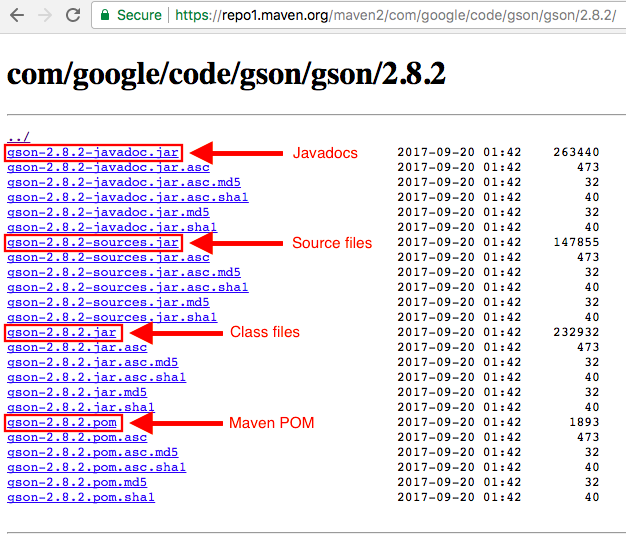
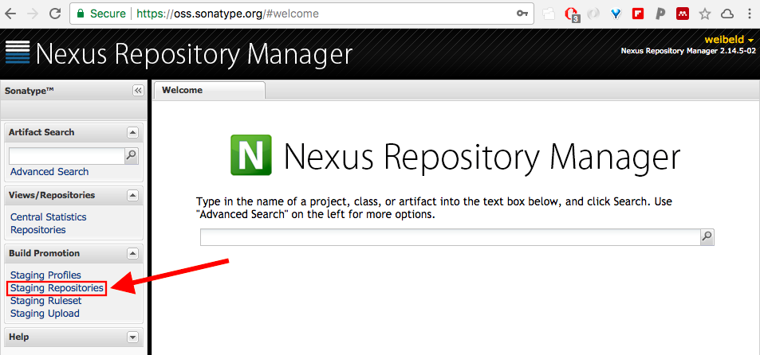
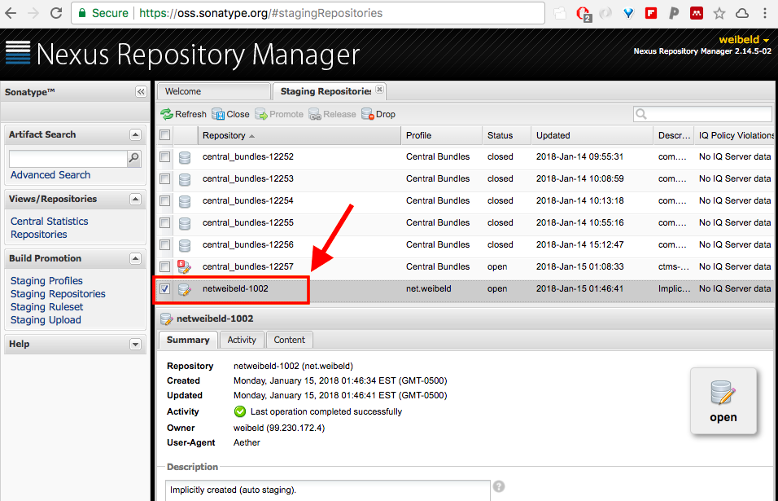
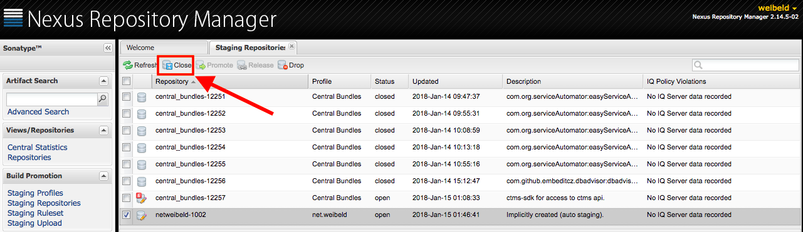
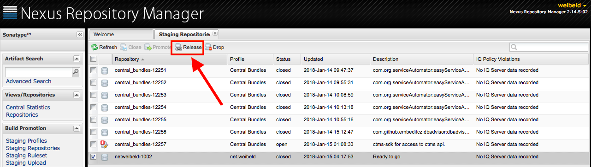

This guide explains how you can publish your own Java software components to the Maven Central Repository.

The document is structured into four main parts:

- [Understanding Maven Central](#understanding-maven-central)
- [Claim Your Namespace on Maven Central](#claim-your-namespace)
- [Deploy to OSSRH](#deploy-to-ossrh)
- [Release from OSSRH to Maven Central](#release-from-ossrh-to-maven-central)

# Important URL Shortcuts

- <https://search.maven.org/>
- <https://repo1.maven.org/maven2/>
- <http://central.sonatype.org/>
- <https://oss.sonatype.org/>

# Understanding Maven Central

The [Maven Central Repository](https://search.maven.org/) is the official public software component repository of the [Maven](https://maven.apache.org/) build system. It hosts open-source software components that can be automatically consumed by different build systems, including Maven, [Ant](http://ant.apache.org/), and [Gradle](https://gradle.org/).

Currently, Maven Central is the largest collection of Java and open-source software components of the world ([see here](http://central.sonatype.org/pages/about.html)).

For sure you're used to include dependencies from Maven Central in your `build.gradle` file, like this:

~~~groovy
dependencies {
    compile 'com.google.code.gson:gson:2.8.2'
}
~~~

The dependency `com.google.code.gson:gson:2.8.2` references to a JAR file that is hosted on the Maven Central Repository. When you build your application, Gradle downloads this JAR file so that the classes defined in this dependency are accessible to your application.

Dependencies on Maven Central are specified in three parts. For the above example dependency these are:

- Group ID: `com.google.code.gson`
- Artifact ID: `gson`
- Version: `2.8.2`

These three parts together define a unique path to a directory in the Maven Central Repository in which the Google Gson JAR file is stored:

~~~
com/google/code/gson/gson/2.8.2
~~~

You can verify this if you go to <https://search.maven.org> and click *BROWSE* in the title bar:

{:width="100%"}

Alternatively, you can directly go to <https://repo1.maven.org/maven2/>.

This is the root directory of the Maven Central Repository. If now you navigate to the `com/google/code/gson/gson/2.8.2` directory, you will see that there's a bunch of files:

{:width="75%"}{:.center-image}

Don't worry, you will not have to generate all these files manually when you publish to Maven Central, they will be generated automatically. 

There are actually just four files with a real content:

- `gson-2.8.2-javadoc.jar`: contains the **Javadocs** of the project
- `gson-2.8.2-sources.jar`: contains the **source code** files of the project
- `gson-2.8.2.jar`: contains the compiled **class** files of the project
- `gson-2.8.2.pom`: the [Maven POM](https://maven.apache.org/guides/introduction/introduction-to-the-pom.html) file of the project

All the other files are signature and hash files of the four main files.

The Maven POM file is there because Maven Central has been originally designed for the Maven build system, even though today it can be used with a variety of build system, including Gradle.

The main file that you are interested in is `gson-2.8.2.jar`. This file contains all the compiled classes of the Google Gson v2.8.2 project. If you download this JAR file and add it to the [classpath](http://kevinboone.net/classpath.html) of your application for compilation and execution, you have successfully "incorporated" Google Gson v2.8.2 in your application, and you can use all the public Google Gson classes.

And, as you guessed, the download of the `gson-2.8.2.jar` file and the inclusion in the classpath is automatically done by Gradle if you specify the following in your `build.gradle` file:

~~~groovy
repositories {
    mavenCentral()
}
dependencies {
    compile 'com.google.code.gson:gson:2.8.2'
}
~~~

## What Is It All About?

So, we have seen that Google publishes its projects in subdirectories of `com/google/` on the Maven Central Repository. For example, they have `com/google/firebase/`, `com/google/guava/`, or `com/google/maps/`.

The directory `com/google/` is reserved for Google, and only Google can write files to this directory and any subdirectories. In other words, `com.google` is Google's namespace on Maven Central.

This guide is about how you can claim **your** personal namespace on Maven Central to which only you can publish, and how you can publish your projects to this namespace. 

For example, if you claim the namespace `com.mydomain`, then you can publish your projects under the `com/mydomain/` directory, and only you can publish to this directory.

If you have a project named `myproject` with version `0.0.1`, you are going to publish it to the directory `com/mydomain/myproject/0.0.1/`,  and now everybody on the world can include your project in their application by simply adding the Maven Central dependency

~~~
com.mydomain:myproject:0.0.1
~~~

to their `build.gradle` file.

# Claim Your Namespace

## Rules of the Game

First of all, you never interact with the Maven Central Repository directly, but any interaction goes through a service called **OSSRH** provided by [Sonatype](http://www.sonatype.org/).

Sonatype is a company producing software component management solutions, and it is the "steward, maintainer and financial sponsor" of the Maven Central Repository ([see here](http://central.sonatype.org/pages/about.html#what-does-sonatype-have-to-do-with-the-central-repository)).

OSSRH stands for Open-Source Software Repository Hosting, and it is a deployment of Sonatype's [Nexus Repository Manager](https://www.sonatype.com/nexus-repository-sonatype).

To publish a software component to Maven Central, you will first deploy it to OSSRH, and then release it from OSSRH to Maven Central, as explained in the [next section](deploy-to-ossrh).

## Documentation

Sonatype's official documentation about publishing to Maven Central is extremely good, and can be found here:  <http://central.sonatype.org>

This documentation also includes a set of very informative videos that you definitely shouldn't miss. All the videos are listed here for convenience:

- [01 - Claim Your Namespace](https://www.youtube.com/watch?v=P_3yo-oU1To)
- [02 - Applying for Access to OSSRH](https://www.youtube.com/watch?v=0gyF17kWMLg)
- [03 - Requirements and Signing Tips for OSSRH](https://www.youtube.com/watch?v=DE3FVty3NgE)
- [04 - Accessing OSSRH](https://www.youtube.com/watch?v=b5D2EBjLp40)
- [05 - First Deployments](https://www.youtube.com/watch?v=dXR4pJ_zS-0)
- [06 - Project Object Model (POM)](https://www.youtube.com/watch?v=N7KXuvi_2SE)
- [07 - Javadoc, Sources and Signing](https://www.youtube.com/watch?v=HeQ70mRSSGE)
- [08 - Getting Help](https://www.youtube.com/watch?v=E8_oByBCbmI)

In general, the Sonatype documentation is the ✅ resource for questions about publising to Maven Central.

## Let's Go

The first thing you have to do when you're new to Maven Central is to claim your namespace on the Maven Central Repository. This has to be done by opening an issue on the Sonatype OSSRH [JIRA](https://www.atlassian.com/software/jira) issue tracking tool.

For this, you have to do two things:

- Sign up for the  Sonatype OSSRH JIRA: [link](https://issues.sonatype.org/secure/Signup!default.jspa)
- Create the issue: [link](https://issues.sonatype.org/secure/CreateIssue.jspa?issuetype=21&pid=10134)

Claiming a namespace works best if you own a domain, for example, `mydomain.com`, and then you claim the namespace `com.mydomain`. It's also beneficial if you use an email address with this domain name for signing up to the OSSRH JIRA, e.g. `me@mydomain.com`.

It works in any other way too, even if you claim a namespace that does not reflect a domain that you own, but the process will take longer, because it requires manual intervention. In these cases, it may take **up to 2 business days** until you finally get your namespace.

In my case, I claimed the namespace `net.weibeld`, because I own the domain `weibeld.net`, and signed up with a `@weibeld.net` email address, and the JIRA issue was automatically handled within **less than 10 minutes**.

Note that if you claim the namespace `com.mydomain`, you can not only use the group ID `com.mydomain`, but also any nested group ID like `com.mydomain.this`, or `com.mydomain.this.that`.

Remember that the tedious process of applying for a namespace has to be done **only once**, and then you can publish as many projects as you want to this namespace.

## Watch the Video

The relevant section in the OSSRH documentation is [here](http://central.sonatype.org/pages/ossrh-guide.html#initial-setup).

The most important information is actually contained in the video [02 - Applying for Access to OSSRH](https://www.youtube.com/watch?v=0gyF17kWMLg&feature=youtu.be), and you should definitely watch it.

# Deploy to OSSRH

Once you got granted your Maven Central namespace, you are ready to publish your projects to Maven Central.

Publishing a project to Maven Central actually requires two steps:

- Deploy the project to OSSRH
- Release the project from OSSRH to Maven Central

I explain the first step in this section, and the second step in the [next section](#release-from-ossrh-to-maven-central).

## Different Ways to Deploy to OSSRH

First of all, different build tools can be used to deploy a project to OSSRH, for example [Ant](http://ant.apache.org/), [Maven](https://maven.apache.org/), or [Gradle](https://gradle.org/). They all result in the same final content on OSSRH, but each build tool works in its own way and must be configured accordingly.

In this guide I only cover how to use **Gradle** to deploy to OSSRH.

With Gradle, again, there are different ways to deploy a software component to OSSRH. The two most important options are to use either the [`maven`](https://docs.gradle.org/current/userguide/maven_plugin.html) plugin with the `upload` task, or the [`maven-publish`](https://docs.gradle.org/current/userguide/publishing_maven.html) plugin with the `publish` task.

A great article comparing these two approaches can be found [here](https://medium.com/dot-debug/deploying-artifacts-to-maven-using-gradle-b669acc1b6f8).

In this guide I'm going to to cover how to use the `maven` plugin with the `upload` task.

## Using the `maven` Plugin

The relevant documentation section about deploying to OSSRH with Gradle and the `maven` plugin is [here](http://central.sonatype.org/pages/gradle.html).

In essence, what we have to do now is to compose a `build.gradle` file with all the required information. This `build.gradle` file will have an `uploadArchives` task, and when we run this task, our project will be built, signed, and uploaded to OSSRH.

That's right, all the files need to be cryptographically signed before uploading them to OSSRH. This is done automatically by the Gradle build script that we are going to create, but it requires some preliminary setup, which is explained in [this section](#setting-up-pgp-signing).

### The Build Script

Here is an example `build.gradle` file for uploading a single artifact to OSSRH:



### Coordinates

As you can see, this Gradle build script defines the following coordinates for the artifact:

- Group ID: `net.weibeld.rabbitmq`
- Artifact ID: `rabbitmq-manager`
- Version: `0.0.1`

That means, this artifact can be included by other Gradle scripts with the identifier `net.weibeld.rabbitmq:rabbitmq-manager:0.0.1`.

### Plugins

Furthermore, the build script uses three plugins:

- The standard `java` plugin providing the standard build tasks
- The `signing` plugin handling the signing of the artifact files
- The `maven` plugin providing the `uploadArchives` task

The `signing` and `maven` plugins require some sensitive information that we cannot include in the `build.gradle` file, because this file will be checked in to Git and most probably end up in a public GitHub repository. Therefore, we define this information in the `~/.gradle/gradle.properties` file:



Note that `<YOUR-OSSRH-USERNAME>` and `<YOUR-OSSRH-PASSWORD>` is the username and password, respectively, that you used to [sign up for the OSSRH JIRA account](#lets-go).

### Meeting OSSRH Requirements

Projects uploaded to OSSRH must meet certain requirements that are described [here](http://central.sonatype.org/pages/requirements.html).

These requirements include:

- Include a Javadoc JAR and sources JAR
- All files must be signed with PGP
- A minimum set of metadata must be provided

The largest part in the above `build.gradle` file is occupied by the definition of metadata. The minimum set of metainformation must include:

- Project name, description, and URL
- License information
- Developer information
- Source control management (SCM) information

Note that behind the scenes the `uploadArchives` task creates a Maven POM file, that is required for software components on Maven Central, and all this metainformation ends up in this POM file.

### Upload to OSSRH

Once your `build.gradle` file looks like the example above, exeute the `uploadArchives` task:

~~~bash
./gradlew uploadArchives
~~~

This builds the project, generates the POM file, signs all the files with PGP, and uploads them to your account on OSSRH.

When the task is finished, go to the OSSRH Nexus Repository Manager on <https://oss.sonatype.org/>, and log in with the username and password that you initially used for signing up for the OSSRH JIRA account (the same credentials that you saved in your `~/.gradle/gradle.properties` file.

Once you're logged in to OSSRH, click on *Staging Repositories* in the left sidebar:

{:width="100%"}

In the appearing list of repositories, search your repository that you just uploaded. It has a name consisting of your group ID with the dots removed:

{:width="100%"}

If your repository meets all the OSSRH [requirements](http://central.sonatype.org/pages/requirements.html), then there should be a green tick ✅ in the *Summary* tab, and your repository should be labelled as *Open*.

If this is the case, then you are ready for the last step, [release your repository to Maven Central](#release-from-ossrh-to-maven-central).

If your repository displays errors, then you need to amend your `build.gradle` file and upload again. The video [06 - Project Object Model (POM)](https://www.youtube.com/watch?v=N7KXuvi_2SE) explains this process.

## Setting Up PGP Signing

Relevant documentation is [here](http://central.sonatype.org/pages/working-with-pgp-signatures.html), and especially the video [03 - Requirements and Signing Tips for OSSRH](https://www.youtube.com/watch?v=DE3FVty3NgE) is very helpful.

All the files uploaded to OSSRH must be digitally signed with the [Pretty Good Privacy (PGP)](https://www.openpgp.org/) encryption standard. You don't need to sign the files yourself, this is done automatically by the Gradle build script, but you just need to set up the signing tool and keys.

### Get the Tool

A command-line tool that can produce PGP signatures is [GnuPG](https://gnupg.org/). If you haven't yet, install GnuPG with Homebrew:

~~~bash
brew install gpg
~~~

This provides the command-line command `gpg`.

### Set Up the Keys

To set up the keys for signing, we have to do the following:

- Generate a private/public key pair
- Upload the public key to a key server
- Configure the Gradle `signing` plugin to use the keys

The private key will be used to sign the documents that we publish to Maven Central. The public key will be used by other users to verify the signature of our files on Maven Central. That is, our public key must be publicly accessible, and that's why we have to upload it to a key server.

### Generate Private/Public Key Pair

To create a new key pair, run the following:

~~~bash
gpg --gen-key
~~~

And provide all the information asked by the prompts.

The generated keys will be saved in `~/.gnupg`.

### Upload Public Key to Key Server

For this, first check the identifier of the just generated public key:

~~~bash
gpg --list-keys
~~~

The identifier is an alphanumeric string listed in the `pub` row of the output of above command.

Then, run:

~~~bash
gpg --keyserver hkp://pool.sks-keyservers.net --send-keys <PUBLID-KEY-ID>
~~~

Where `<PUBLIC-KEY-ID>` is the identifier of the public key to upload.

### Configure the `signing` Plugin

We use the `signing` plugin in the Gradle build script, and we need to tell it somehow which keys to use for signing.

We can do this by adding the following lines to the `~/.gradle/gradle.properties` file:

~~~
signing.keyId=<PUBLIC-KEY-ID>
signing.password=<YOUR-PASSWORD>
signing.secretKeyRingFile=~/.gnupg/secring.gpg
~~~

Where `<PUBLIC-KEY-ID>` are the last 8 digits of the public key identifier displayed with `gpg --list-keys`, and `<YOUR-PASSWORD>` is the password you chose when you created the key pair.

The `~/.gnupg/secring.gpg` file is the private key to be used for signing.

There's a gotcha here: if you use GnuPG v2.1 or later, there is no `~/.gnupg/secring.gpg` file. This issue is discussed [here](https://github.com/gradle/gradle/issues/888), and you can work around it by creating the `secring.gpg` file like this:

~~~bash
gpg --export-secret-keys >~/.gnupg/secring.gpg
~~~

And that's it! Now everything is set up for your Gradle build script to sign your artifact files.

# Release from OSSRH to Maven Central

Releasing a repository from OSSRH to Maven Central means to make it available on <https://repo1.maven.org/> and <http://search.maven.org/>.

The relevant section in the Sonatype documentation is [here](http://central.sonatype.org/pages/releasing-the-deployment.html).

The release is typically done manually in the OSSRH Nexus Repository Manager GUI. It consists of simply *closing* and then *releasing* your OSSRH staging repository.

Select your repository in the list and click on *Close*:

{:width="100%"}

Wait for the closing process to finish. When this is done, the *Refresh* button should become activated for your repository. Click it:

{:width="100%"}

Again, wait for the release process to finish. Your repository should now be removed from the OSSRH staging repositories. 

**Congratulations!** At this point your project is successfully published to Maven Central. You can now go to <https://repo1.maven.org/> and navigate to the directory structure corresponding to your group ID, artifact ID, and version. All the files should now be there!

Note that while on <https://repo1.maven.org/> your project appears immediately, it may take up to some hours for your project to appear in the search on <http://search.maven.org/>. 

## Automated Release

You can use the [Gradle Nexus Staging plugin](https://github.com/Codearte/gradle-nexus-staging-plugin/) to automate the release process. That means, you can release your project to Maven Central without logging in to the OSSRH Nexus Repository Manager GUI. However, I didn't yet test this feature.

