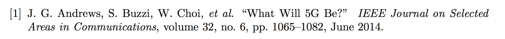

These are some `.bst` files that I created according to the instructions [here](using-bibtex.html#how-to-create-a-custom-bibtex-style). 

Note that the `.dbj` file is the output of the interactive `latex makebst` utility, and it is the file that you should be edited manually, if you want to change anything in the style.

To create the `.bst` file from the `.dbj` file, use `latex file.dbj`.

# my_alphorder

The main characteristics of this bibliography style are:

- Ordering of references in alphabetical order of the first author's last name
- Author names: initials + surname (e.g. "J. F. Smith")
- Maximum three authors listed (remaining authors replaced by et al.)
- Date as month + year (e.g "October 2017")
- Titles (including punctuation) in double quotes
- Capitalisation of titles is *not* modified
- Journal names in italics
- No ISBN, ISSN, DOI
- No word "in" for collections and proceedings

An example bibliography item looks like this:

{:width="100%"}

 [Find Me Here](https://gist.github.com/weibeld/d0e662f4de558f294e8147457cbf3ba2)

# my_citorder

This style is identical to [my_alphorder](#my_alphorder), except that bibliography items are sorted in the order they are cited in the text.

 [Find Me Here](https://gist.github.com/weibeld/d3b91a7938f597c98c14ddd64efcf11c)

