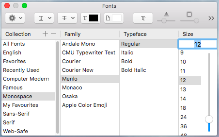

The fonts used by many Mac applications (for example, TextEdit, OmniGraffle) are actually installed on the system, and the application accesses them through the macOS **Font Panel**.

The Font Panel is a window like this:

{:width="40%"}{:.center-image}

The following explains how to install any font on your Mac, so that this font will be accessible to every application that uses the macOS Font Panel.

# Font Fundamentals

## Font Formats

- **TrueType Format** (TTF): Apple late 1980s, most common font format on Mac and Windows
- **OpenType Format** (OTF): Microsoft 1996, built on top of TTF
- **Web Open Font Format** (WOFF): TTF or OTF with compression for submitting fonts over the network (Web Fonts)

See overview [here](https://www.w3schools.com/css/css3_fonts.asp).

## Font File Extensions

- `.otf`: OpenType Format
- `.ttf`: TrueType Format
- `.ttc`: TrueType Collection: extension of TTF, allows to combine multiple TTF fonts in a single file
- `.dfont`: Data Fork Suitcase Format (special TTF format developed for Mac)

# How to Install a Font on Mac

On Mac, each font is stored in one of the above [file formats](#font-file-extensions) in one of the following folders (see [here](https://support.apple.com/en-vn/HT201722)):

- `~/Library/Fonts`
- `/Library/Fonts`
- `/System/Library/Fonts`

Installing a new font on Mac is very easy:

1. Download a `.otf`, `.ttf`, `.ttc`, or `.dfont` file
2. Copy the file into one of the above font directories
3. That's it! The font will immediately appear in the fonts panel of any application using fonts

## Using Font Book

Alternatively, fonts can be installed and managed with the [Font Book](https://support.apple.com/en-vn/HT201749) application.

FontBook has the following functions:

- **Installing fonts:** in this case, Font Book does nothing else than copying the font file to either `~/Library/Fonts` or `/Library/Fonts`
- **Disabling fonts:** the font is still present in the fonts folder, but it doesn't appear in the system-wide Font Panel
- **Organising fonts:** fonts can be organised into collections which are accessible visible from the macOS Font Panel
    - The meta information about these collections is saved in `~/FontCollections`

