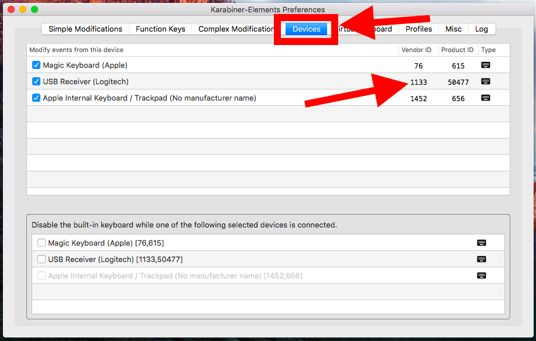

A wireless presenter is a very useful device for switching between the full-screen slides in a presentation. This document explains how to remap the keys of the presenter, to make it work with a specific presentation software.

# How Does A Wireless Presenter Work?

A wireless presenter is basically just a wireless keyboard with very few keys. The most important of these keys are the *Next* and *Previous* keys, which are supposed to switch to the next and previous slide in the presentation, respectively.

In many presenters, the *Next* and *Previous* keys are mapped to *Page Down* and *Page Up*. This means that pressing the *Next* key on the presenter is really just the same thing as pressing *Page Down* on the computer keyboard.

These default functions of presenter keys are chosen like this, because many presentation applications (for example, Microsoft Power Point) used *Page Up* and *Page Down* to switch between slides in presentation mode.

However, your specific presentation software might use other keys for switching between slides, and in this case the presenter seems to "not work".

If your presenter doesn't work with your presentation software, you need to know two things in order to make it work:

1. What function do the keys on your presenter have?
2. Which keys does your presentation software use?

# What Functions Do The Keys On My Presenter Have?

To find out the functions of the keys on your presenter, open Apple's built-in **Keyboard Viewer**. You find it in the *Input Menu* of the menu bar, as shown below:

{:.center-image}

If you click *Show Keyboard Viewer*, a small keyboard appears on the screen, which highlights every key as it is pressed.

{:.center-image}

Now, just press all the keys on your presenter and observe which keys get highlighted in the *Keyboard Viewer*.

## Example: Logitech R700

The [Logitech R700 Presenter](https://www.logitech.com/en-roeu/product/professional-presenter-r700) has four keys, as show on this picture:

{:width="30%"}{:.center-image}

The functions of these keys, as revealed by *Keyboard Viewer*, are as follows:

| Presenter Key | Function
|:-|:-
| Next     | *Page Down*
| Previous | *Page Up*
| Start/Stop | Alternating between *F5* and *Esc*
| Hide     | . (period)
{:.table-normal} 

These functions are clearly targeted at Microsoft Power Point under Windows. *F5* enters *Slide Show Mode* and *Esc* exits it. The dot key hides the current slide. 

Different presentation applications use different keys for these tasks. Even Microsoft Power Point under Mac uses *Cmd-Shift-Enter* to enter *Slide Show Mode*, rather than *F5*.

So, now you have to find out which keyboard shortcuts your specific presentation application uses.

# Which Keys Does My Presentation Software Use?

You can check if the keyboard shortcuts of your application are listed in the application's manual. If not, you can search it on Google, or simply trying it out in the application.

These keys will be the targets to which you need to remap the keys of your presenter.

> In case you want to enter *Page Up* and *Page Down* on a Mac keyboard, use *fn-Arrow Up* and *fn-Arrow Down*, respectively.

## Example: Preview

[Preview](https://support.apple.com/en-us/HT201740) is the default PDF and image viewer of macOS, and it can be used for presentations in PDF format (you can also use Preview for photo slideshows)

The presentation control keys of Preview are as follows:

| Task | Key Function
|:-|:-
| Next slide | *Arrow Right*
| Previous slide | *Arrow Left*
| Start slideshow | *Cmd-Shift-F*
| End slideshow | *Esc*
| Hide current slide | not supported
{:.table-normal}

# Remappings For Logitech Presenter And Preview

So, based on the above examples, if we want to make the Logitech R700 presenter work with Preview slideshows, we have to do the following key remappings:

| Presenter Key | Old Function | New Function
|:-|:-|:-
| Next | *Page Down* | *Arrow Right*
| Previous | *Page Up* | *Arrow Left*
| Start/Stop | *F5* | *Cmd-Shift-F*
{:.table-normal}

Since Preview has no "hide current slide" functionality, we don't remap the *period* function of the *Hide* key on the presenter.

The *Start/Stop* key of the Logitech presenter has two functions that alternate (the alternation between them is managed internally by the presenter). One of these functions, *Esc* for ending the slideshow, works fine with Preview, so we don't need to remap it. We just need to remap the *F5* function used for starting the slideshow.

So, now how can we remap the key functions of an input device like the wireless presenter?

# Karabiner

[Karabiner](https://pqrs.org/osx/karabiner/) is a Mac-based tool that allows to remap the keys for almost all kinds of input devices.

This basically means that whenever a key is pressed on an input device, Karabiner intercepts the signal sent by the device, checks if it has a remapping rule for this key, and if yes, changes the signal, and passes it on to the application which is receiving the input from this device.

So, if for example, a *Page Down* is remapped to a *Arrow Left* in Karabiner, the target application receives an *Arrow Left*, even if a *Page Down* has been pressed on the input device.

## Remappings Per Device And Application

What's particularly good with Karabiner is that it allows to do remappings **application-specifc** and **device-specific**. This means that you can define a remapping that applies only when both of the following conditions are met:

2. The input comes from a specified device
1. A specified application has focus (i.e. is the receiver of the input device)

To show what this means, let's assume we defined the remapping *Page Down* $\rightarrow$ *Arrow Right* for the application **Preview** and for the device **Logitech R700**.

The following shows in which scenarios the remapping applies, and in which it does not:

- Pressing *Page Down* on Logitech R700, and Preview in focus: **applies**
- Pressing *Page Down* on Logitech R700, and another app in focus: **does not apply**
- Pressing *Page Down* on another device, and Preview in focus: **does not apply**
- Pressing *Page Down* on another device, and another app in focus: **does not apply**

This allows that the application-specific remappings of a device apply really only to this application, and not to other applications for which they might be inappropriate. For example, the presenter key remappings for Preview make no sense for Microsoft Power Point.

However, we could define another remapping for the same presenter device, but targeted at the Power Point application. Then, whenever we use the presenter with Preview, the Preview remapping applies, and whenever we use the presenter with Power Point, the Power Point remapping applies.

# How To Use Karabiner 

In the following, I'm going to describe how to implement the remappings listed [above](#remappings-for-logitech-presenter-and-preview) to make the Logitech R700 presenter work with Preview slideshows.

The same instructions apply to any other combinations of presenter and presentation application. You just have to adapt the key mappings, app ID, vendor ID, and product ID in the configuration JSON file accordingly, as explained below.

## Download and Install

You can download and install the newest Karabiner version  from [here](https://pqrs.org/osx/karabiner/index.html).

Make sure to pick the newest version (v11.1.0 or above). This version is is actually called *Karabiner-Elements*, in contrast to an older version (v10.22.0), which is just called *Karabiner*. The problem with the old version is that it doesn't work on macOS Sierra (10.12) and above.

## Adding a "Complex Modification" Rule

In order to implement the required remappings, we have to define a so-called "complex modification" for Karabiner.

> Karabiner also has "simple modifications" which only allow the remapping of a single key to a single other key, and cannot be application-specific. So, this is not an option for our scenario.

A "complex modification" has to be defined in JSON and saved as a file in the following directory:

~~~
~/.config/karabiner/assets/complex_modifications
~~~
{:#karabiner-dir}

The following is the "complex modification" JSON file implementing the remappings from the above [table](#remappings-for-logitech-presenter-and-preview):

~~~json
{
  "title": "Logitech Wireless Presenter",
  "rules": [
    {
      "description": "Logitech R700 + Preview: Page-Up/Down to Left/Right-Arrow and F5 to Cmd-Shift-F",
      "manipulators": [
        {
          "type": "basic",
          "from": { "key_code": "page_up" },
          "to": [ { "key_code": "left_arrow" } ],
          "conditions": [
            {
              "type": "device_if",
              "identifiers": [
                {
                  "vendor_id": 1133,
                  "product_id": 50477
                }
              ]
            },
            {
              "type": "frontmost_application_if",
              "bundle_identifiers": [ "^com\\.apple\\.Preview$" ]
            }
          ]
        },
        {
          "type": "basic",
          "from": { "key_code": "page_down" },
          "to": [ { "key_code": "right_arrow" } ],
          "conditions": [
            {
              "type": "device_if",
              "identifiers": [
                {
                  "vendor_id": 1133,
                  "product_id": 50477
                }
              ]
            },
            {
              "type": "frontmost_application_if",
              "bundle_identifiers": [ "^com\\.apple\\.Preview$" ]
            }
          ]
        },
        {
          "type": "basic",
          "from": { "key_code": "f5" },
          "to": [
            {
                "key_code": "f",
                "modifiers": [
                    "left_command",
                    "left_shift"
                ]
            }
          ],
          "conditions": [
            {
              "type": "device_if",
              "identifiers": [
                {
                  "vendor_id": 1133,
                  "product_id": 50477
                }
              ]
            },
            {
              "type": "frontmost_application_if",
              "bundle_identifiers": [ "^com\\.apple\\.Preview$" ]
            }
          ]
        }
      ]
    }
  ]
}
~~~

The above file is specific to the Preview app and the Logitech R700 presenter. If you want to adapt it to another app and device, you have to adapt the app IDs, vendor IDs and product IDs accordingly, as described further below.

## Structure of the JSON File

JSON is not very "human-readable", but basically, we define a single element for the `"rules"` array consisting of a `"description"` and a `"manipulators"` array. Each element of the `"manipulators"` array is an object defining a single remapping from one key to another. Each of these objects has the following fields:

- `"type"`
- `"from"`
- `"to"`
- `"conditions"`

`"from"` defines the source key, and `"to"` defines the target key.

`"conditions"` is an array of condition objects. In our case, there are two condition object in the array: the first one defines the device to which to apply by its vendor ID and product ID; the second one defines the app to which to apply by its app ID.

## How To Find Out An App ID?

Every app on macOS has a unique app ID (or bundle ID), which usually has the form of an inverted domain name, like, for example, `com.apple.Preview`.

To find out the app ID of any application on your Mac, execute the following command:

~~~bash
osascript -e 'id of app "App Name"'
~~~

Replace `App Name` with the name of the application. This name must be name displayed next to the  symbol in the menu bar when the application is running.

In the Karabiner JSON file, app IDs are specified as regular expressions of the form `"^com\\.apple\\.Preview$"`. Just leave the escape and control characters as they are.

For example, if your app ID is `com.microsoft.Powerpoint`, use the following in the JSON file:

~~~
"^com\\.microsoft\\.Powerpoint$"`
~~~

## How To Find The Vendor ID And Product ID Of A Device?

If your presenter is connected, you can see its vendor ID and product ID in the *Devices* tab of Karabiner, as shown below:

{:.center-image}{:width="80%"}

Note that the vendor ID and product ID listed in Karabiner are in **decimal** notation, and they must also be inserted in the JSON file in decimal notation.

## Activating the Rule

After saving your JSON file to `~/.config/karabiner/assets/complex_modifications`, in Karabiner go to the *Complex Modifications* tab, click *Add Rule*, and now the just installed rule should be listed there. Select it and click *Enable*, as shown in the following screenshots:

{:.center-image}{:width="80%"}

{:.center-image}{:width="80%"}

> Note that whenever you make changes to the JSON file, you need to remove the rule in the *Complex Modifications* tab, and add it again, in order to reload the JSON file.

That's it! Now the rule is enabled and applies whenever you use your specific presenter with your specified presentation applicatoin (and not otherwise, as desired).

Note that all remapping rules defined in Karabiner apply only when Karabiner is running (indicated by an icon in the menu bar).

## Caveats

### System modifier key settings

The current version of Karabiner ignores the modifier key settings in *System Preferences > Keyboard > Modifier Keys...*. If you have custom settings there and you don't want Karabiner to undo them, you can add similar "simple modification" rules in the *Simple Modifications* tab of Karabiner.

Alternatively, you can completely exclude the input devices in question from being affected by Karabiner by unchecking them in the *Devices* tab, as shown below:

{:.center-image}{:width="80%"}

### No documentation for defining complex modifications

There is currently no documentation of the JSON schema for defining complex modifications. The best one can do is to start from existing complex modification rules and edit them. There is a large collection of complex modification JSON files in [this](https://github.com/pqrs-org/KE-complex_modifications) GitHub Repository.

> By the way, most complex modifications of the above GitHub repository can be directly imported to Karabiner under *Complex Rules > Add Rule > Import more rules from the Internet*. They will be saved in the "complex modifications" directory listed [above](#karabiner-dir).

There is also a sample "complex modification" file provided by Karabiner here:

~~~
/Library/Application Support/org.pqrs/Karabiner-Elements/complex_modifications_rules_example.json
~~~

The names for the keyboard keys used by Karabiner (e.g. `left_command`) can be found out with the *Karabiner-EventViewer* app, which is included in the Karabiner installation. It displays the name of each key as it is pressed on the keyboard.

A list of all the keyboard key names can also be found in this GitHub [issue comment](https://github.com/tekezo/Karabiner-Elements/issues/925#issuecomment-323984568).

# Old Karabiner Version

There is also an old version of Karabiner (v10.22.0), which works up to macOS El Capitan (10.11). 

The advantage of the old version is that the manual editing of the configuration file is more straightforward, as it is in XML rather than JSOn, and that it does not suffer from the caveat of ignoring the modifier key settings in *System Preferences > Keyboard > Modifier Keys...*, that is described above for the new version.

The disadvantage of the old version is that it does not work on macOS Sierra (10.12) and above.

For completeness, here is how to perform the same remapping scenario with the old Karabiner version.

## How To Use The Old Karabiner Version

The old Karabiner version can also be installed from the Karabiner [website](https://pqrs.org/osx/karabiner/). Make sure to choose the 10.22.0 version labelled *Karabiner*, rather than *Karabiner-Elements*.

After installing it, go to the *Misc & Uninstall* Tab and click *Open private.xml*, as shown below:

{:.center-image}{:width="80%"}

This opens the directory of the `private.xml` file in Finder. This is the configuration file that contains all the custom remapping rules.

You can also directly find the file here:

~~~
~/Library/Application\ Support/Karabiner/private.xml
~~~

Edit the `private.xml` file to look like this:

~~~xml
<?xml version="1.0"?>
<root>
  <!-- Target app -->
  <appdef>
    <appname>Preview</appname>
    <equal>com.apple.Preview</equal>
  </appdef>

  <!-- Target device vendor ID -->
  <devicevendordef>
    <vendorname>Logitech</vendorname>
    <vendorid>0x046d</vendorid>
  </devicevendordef>

  <!-- Target device product ID -->
  <deviceproductdef>
    <productname>Presenter</productname>
    <productid>0xc52d</productid>
  </deviceproductdef>

  <!-- Key remapping rule -->
  <item>
    <name>Logitech Presenter and Preview</name>
    <identifier>private.logitech-presenter-and-preview</identifier>
    <!-- Link to target app and device-->
    <only>Preview</only>
    <device_only>DeviceVendor::Logitech, DeviceProduct::Presenter</device_only>
    <!-- Key mappings -->
    <autogen>__KeyToKey__ KeyCode::PAGEDOWN, KeyCode::CURSOR_RIGHT</autogen>
    <autogen>__KeyToKey__ KeyCode::PAGEUP, KeyCode::CURSOR_LEFT</autogen>
    <autogen>__KeyToKey__ KeyCode::F5, KeyCode::F, ModifierFlag::COMMAND_L | ModifierFlag::SHIFT_L</autogen>
  </item>
</root>
~~~

## Structure of the XML Configuration File

In the `<appdef>` tag, we declare the target application of the rule by the means of its app ID. How to find out the app ID of an application is explained [here](#how-to-find-out-an-app-id). For the name in `<appname>`, you can choose any identifier.

In the `<devicevendordef>` and `<deviceproductdef>` tags, we declare the vendor ID and the product ID of the target device, respectively.

To find out the **vendor ID** and **product ID** of a device, go to  *> About This Mac > System Report...*. In the window that pops up, locate the category of your device in the left column. If your device is a presenter with a USB receiver, it is listed under *Hardware > USB*. If you click on your device in the main panel, information about it is displayed in a panel below. This information should include the device's vendor ID and product ID.

> Note that the vendor ID and product ID listed in the *System Report* are in **hexadecimal** notation, and they must be entered in the Karabiner XML file in hexadecimal notation.

For the `<vendorname>` and `<productname>` tags, you can choose any identifier.

Finally, in the `<item>` tag we define the rule itself. We reference the previously declared application in the `<only>` tag, and the device in the `<device_only>` tag by the means of the identifiers that we chose. Then we define the individual key remappings of the rule in the `<autogen>` tags.

## Activating the Rule

After saving the `private.xml` file, go to the *Change Key* tab in Karabiner, and click *Reload XML*. Now the item defined in `private.xml` should appear in the list. Check its checkbox to activate it, as shown below:

{:.center-image}{:width="80%"}

And that's it again! Now the rule is activated, and the remapping rules apply whenever you use your specific presenter device with the specified application.

Note again that the remappings are only applied when Karabiner is running.

# Going Further

Once you know how to remap the keys of your presenter with Karabiner, you can use it for much more than just presentations.

For example, I remapped the keys of my presenter to the keyboard shortcuts used by the **Google Play Music player** (running in a web browser). In this way, I can use the presenter as a remote control for my music player. 

You can, for example, also make your presenter a remote control for YouTube by mapping the keys to the **YouTube** shortcuts listed [here](https://www.hongkiat.com/blog/useful-youtube-keyboard-shortcuts-to-know/).

Since the remapping rules are application-specific, they don't interfer with each other, and you can switch back and forth between different applications running at the same time, and your presenter always performs the right action.

# References

- Two blog posts addressing a similar problem: [2012/08](http://prezentation.ch/2012/08/logitech-presenter-r400-und-r800-mit-keynote/) and [2014/08](https://prezentation.ch/2014/08/logitech-presenter-r400-r700-und-r800-mit-keynote/)
- [Karabiner website](https://pqrs.org/osx/karabiner/)
- [Karabiner on GitHub (new version)](https://github.com/tekezo/Karabiner-Elements)
- [Karabiner on GitHub (old version)](https://github.com/tekezo/Karabiner)
- Collection of Karabiner "complex modifications" (for new Version of Karabiner)
    - [GitHub](https://github.com/pqrs-org/KE-complex_modifications)
    - [Web interface](https://pqrs.org/osx/karabiner/complex_modifications/)

