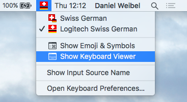
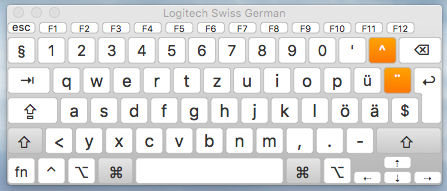
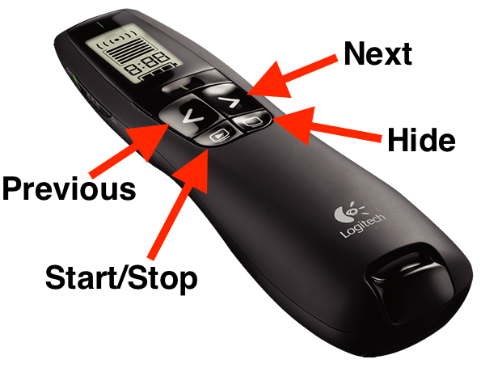
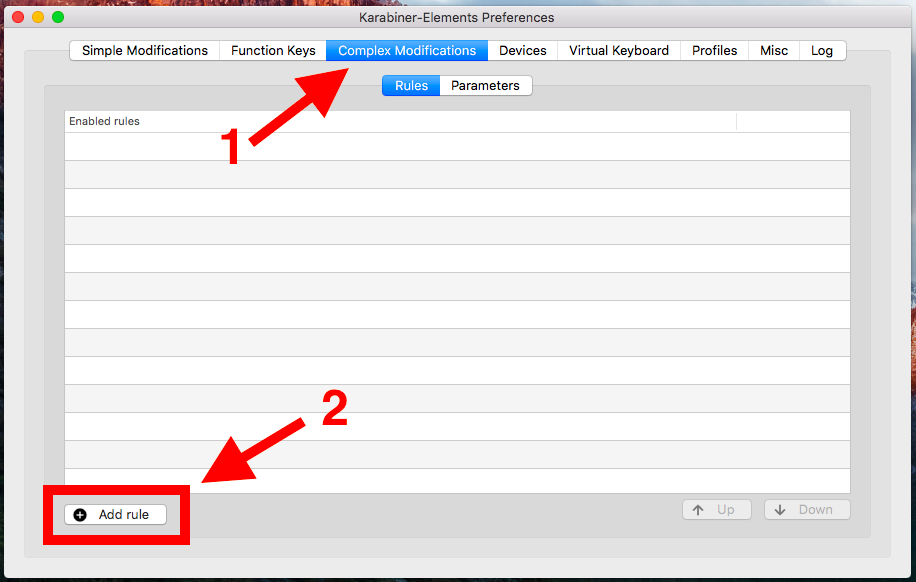
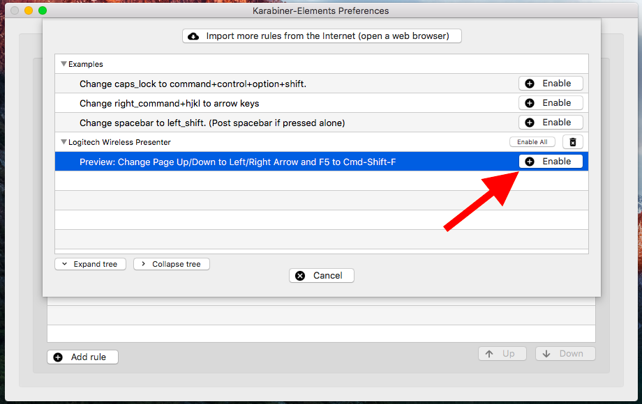
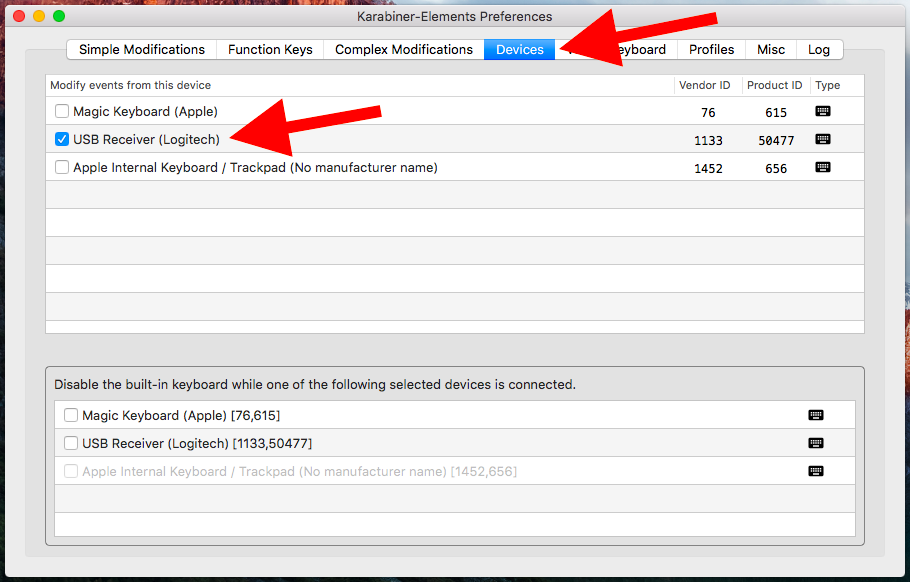
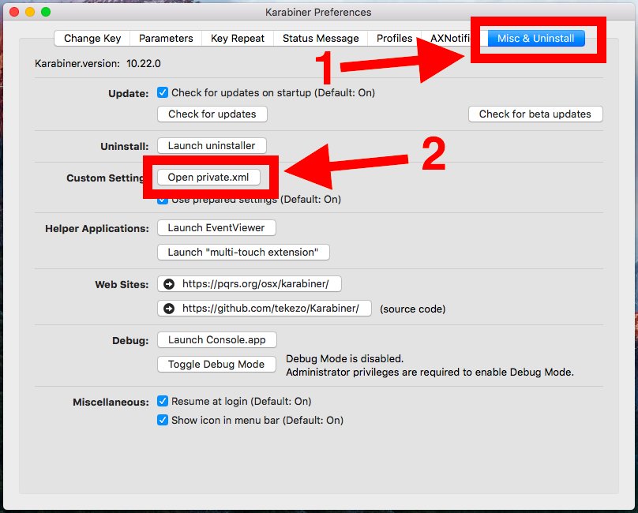
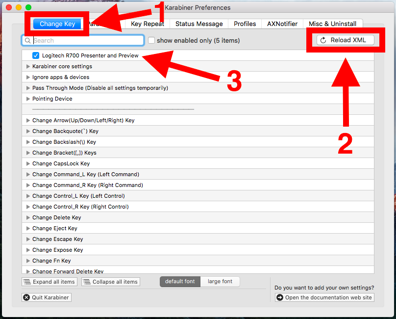

A wireless presenter is a very useful device for switching between the full-screen slides in a presentation. This document explains how to remap the keys of the presenter, to make it work with a specific presentation software.

# How Does A Wireless Presenter Work?

A wireless presenter is basically just a wireless keyboard with a very few keys. The most important of these keys are the *Next* and *Previous* keys, which are supposed to switch to the next and previous slide in the presentation, respectively.

In many presenters, the *Next* and *Previous* keys are mapped to *Page Down* and *Page Up*. This means that pressing the *Next* key on the presenter is really just the same thing as pressing *Page Down* on the computer keyboard.

These default functions of presenter keys are chosen like this, because many presentation softwares (for example, Microsoft Power Point) used *Page Up* and *Page Down* to switch between slides in presentation mode.

However, your specific presentation software might use other keys for switching between slides, and in this case the presenter seems to "not work".

If your presenter doesn't work with your presentation software, you need to know two things in order to make it work:

1. What function do the keys on your presenter have?
2. Which keys does your presentation software use?

# Which Functions Do The Keys On My Presenter Have?

To find out the functions of the keys on your presenter, open Apple's built-in **Keyboard Viewer**. You find it in the *Input Menu* of the menu bar, as shown below:

{:.center-image}

If you click *Show Keyboard Viewer*, a small keyboard appears on the screen, which highlights every key as it is pressed.

{:.center-image}

Now, just press all the keys on your presenter and observe which keys get highlighted in the *Keyboard Viewer*.

## Example: Logitech R700

The [Logitech R700 Presenter](https://www.logitech.com/en-roeu/product/professional-presenter-r700) has four keys, as show on this picture:

{:width="30%"}{:.center-image}

The functions of these keys, as revealed by *Keyboard Viewer*, are as follows:

| Presenter Key | Function
|:-|:-
| Next     | *Page Down*
| Previous | *Page Up*
| Start/Stop | Alternating between *F5* and *Esc*
| Hide     | . (period)

These functions are clearly targeted at Microsoft Power Point under Windows. *F5* enters *Slide Show Mode* and *Esc* exits it. The dot key hides the current slide. 

Different presentation software use different keys for these tasks. Even Microsoft Power Point under Mac uses *Cmd-Shift-Enter* to enter *Slide Show Mode*, rather than *F5*.

So, you have to find out which keys your specific presentation software uses.

# Which Keys Does My Presentation Software Use?

Find out the keys for switching between slides, starting and stopping the presentation, etc. by playing around in your presentation software and checking the menus.

These keys will be the targets to which you need to remap the keys of your presenter.

> In case you want to enter *Page Up* and *Page Down* on a Mac keyboard, use *fn-Arrow Up* and *fn-Arrow Down*, respectively.

## Example: Preview

[Preview](https://support.apple.com/en-us/HT201740) is the default PDF and image viewer of macOS, and it can be used for presentations in PDF format.

The presentation control keys of Preview are as follows:

| Task | Key Function
|:-|:-
| Next slide | *Arrow Right*
| Previous slide | *Arrow Left*
| Start slideshow | *Cmd-Shift-F*
| End slideshow | *Esc*
| Hide current slide | not supported

# Remappings For Logitech Presenter And Preview

So, based on the above examples, if we want to make the Logitech R700 presenter work with Preview, we have to do the following key remappings:

| Presenter Key | Old Function | New Function
|:-|:-|:-
| Next | *Page Down* | *Arrow Right*
| Previous | *Page Up* | *Arrow Left*
| Start/Stop | *F5* | *Cmd-Shift-F*

Since Preview has no "hide current slide" functionality, we don't remap the *period* function of the *Hide* key on the presenter.

The *Start/Stop* key of the Logitech presenter has two functions that alternate (the alternation between them is managed internally by the presenter). One of these functions, *Esc* for ending the slideshow, works fine with Preview, so we don't need to remap it. We just need to remap the *F5* function used for starting the slideshow.

So, now how can we remap the key functions of our presenter according to the above table?

# Karabiner

[Karabiner](https://pqrs.org/osx/karabiner/) is a Mac-based tool that allows to remap the keys for almost all kinds of input devices.

This basically means that whenever a key is pressed on an input device, Karabiner intercepts the sent key function, checks if it has a remapping rule for this key, and if yes, changes the key function, and passes it on to the application which is receiving input from this device.

So, if for example, a *Page Down* is remapped to a *Arrow Left* in Karabiner, the target application receives an *Arrow Left*, even if a *Page Down* has been pressed on the input device.

## Remappings Per Device And Application

What's particularly good with Karabiner is that it allows to do remappings **application-specifc** and **device-specific**. This means that you can define a remapping that applies only when both of the following conditions are met:

2. The input comes from a specified device
1. A specified application has focus (i.e. is the receiver of the input from the input device)

To show what this means, let's assume we defined the remapping *Page Down* $\rightarrow$ *Arrow Right* for the application **Preview** and for the device **Logitech R700**.

The following shows in which scenarios the remapping applies, and in which it does not:

- Pressing *Page Down* on Logitech R700, and Preview in focus: **applies**
- Pressing *Page Down* on Logitech R700, and another app in focus: **does not apply**
- Pressing *Page Down* on another device, and Preview in focus: **does not apply**
- Pressing *Page Down* on another device, and another app in focus: **does not apply**

This allows that the application-specific remappings of a device apply really only to this application, and not to other applications for which they might be inappropriate. For example, the presenter key remappings for Preview make no sense for Power Point.

We could even define another different remapping for the same presenter targeted at Power Point. Then, whenever we use the presenter with Preview, the Preview remapping applies, and whenever we use the presenter with Power Point, the Power Point remapping applies.

# How To Use Karabiner 

In the following, we are going to describe how to implement the remappings listed [above](#remappings-for-logitech-presenter-and-preview) to make the Logitech R700 presenter work with Preview.

The same instructions apply to any other combinations of presenter and presentation application. You just have to adapt the key mappings and application IDs accordingly.

You can download and install the newest Karabiner version  from [here](https://pqrs.org/osx/karabiner/index.html).

This new version (v11.1.0 or above) is called *Karabiner-Elements*, in contrast to an older version (v10.22.0), which is just called *Karabiner*.

In order to implement the required remappings, we have to define a so-called "complex modification" for Karabiner.

The user-defined "complex modifications" have to be specified as JSON files, and saved in the following directory:

~~~
~/.config/karabiner/assets/complex_modifications
~~~

The following is the "complex modification" that defines our remappings from [above](#remappings-for-logitech-presenter-and-preview):

~~~json
{
  "title": "Logitech Wireless Presenter",
  "rules": [
    {
      "description": "Preview: Change Page Up/Down to Left/Right Arrow and F5 to Cmd-Shift-F",
      "manipulators": [
        {
          "type": "basic",
          "from": { "key_code": "page_up" },
          "to": [ { "key_code": "left_arrow" } ],
          "conditions": [
            {
              "type": "frontmost_application_if",
              "bundle_identifiers": [ "^com\\.apple\\.Preview$" ]
            }
          ]
        },
        {
          "type": "basic",
          "from": { "key_code": "page_down" },
          "to": [ { "key_code": "right_arrow" } ],
          "conditions": [
            {
              "type": "frontmost_application_if",
              "bundle_identifiers": [ "^com\\.apple\\.Preview$" ]
            }
          ]
        },
        {
          "type": "basic",
          "from": { "key_code": "f5" },
          "to": [
            {
                "key_code": "f",
                "modifiers": [
                    "left_command",
                    "left_shift"
                ]
            }
          ],
          "conditions": [
            {
              "type": "frontmost_application_if",
              "bundle_identifiers": [ "^com\\.apple\\.Preview$" ]
            }
          ]
        }
      ]
    }
  ]
}
~~~

You have to copy this file to the above directory (the name of the file itself doesn't matter).

JSON is not very "human-readable", but it can be seen that we define three key remappings, each one targeted at the `com.apple.Preview` application.

After installing the above JSON file, open Karabiner, go to the *Complex Modifications* tab, click *Add Rule*, and now the just installed rule should be listed there. Select it and click *Enable*, as shown in the following screenshots:

{:.center-image}{:width="80%"}

{:.center-image}{:width="80%"}

That's it! Now whenever you use the Logitech presenter with Preview, Karabiner remaps the presenter's *Page Down* signal to an *Arrow Right* signal, etc., which allows you to control your Preview presentation with your Logitech presenter.

Note that the remappings are only applied when Karabiner is running (that is, when its icon is displayed in the menu bar).

## Caveats

### No device-specific complex modifications

The new version of Karabiner (v.11.1.0 or above), currently does not allow to make "complex modifications" device-specific. This means that "complex modifications" apply to *all* input devices. On the other hand, "simple modifications" (mappings of a single key to a single other key) can be made device-specific, but not application-specific (*doh!*).

To avoid that the presenter remappings apply to the keyboard, and other input devices, you can deselect all but the presenter from the *Devices* tab, as shown below:

{:.center-image}{:width="80%"}

This limitation will hopefully be fixed in future versions of Karabiner. In the meantime, keep an eye on the issues in Karabiner's [GitHub repository](https://github.com/tekezo/Karabiner-Elements).

### System modifier key settings

The new version of Karabiner ignores the modifier key settings in *System Preferences > Keyboard > Modifier Keys...*. To fix this, either add similar rules in the *Simple Modifications* tab of Karabiner, or deselect the keyboard device in the *Devices* tab, as shown above.

### Not straightforward to define complex modifications

There is a lack of documentation of the JSON schema for defining complex modifications. For now, the best one can do is to learn by example from the many existing complex rule JSON files collected in the related [KE-complex_modifications](https://github.com/pqrs-org/KE-complex_modifications) GitHub Repository.

By the way, most complex modifications of this GitHub repository can be directly imported into Karabiner under *Complex Rules > Add Rule > Import more rules from the Internet*. They will be saved in the `~/.config/karabiner/assets/complex_modifications` directory.

# Old Karabiner Version

There is also an older version of Karabiner (v10.22.0), which works up to macOS El Capitan (10.11). This version can also be installed from the Karabiner [website](https://pqrs.org/osx/karabiner/).

The advantage of the old version is that it doesn't suffer from the caveats that are described above for the new version. The disadvantage of the old version is that it doesn't work on macOS Sierra (10.12) and above.

In particular, the old version allows to make the remappings for the Logitech presenter **device-specific**, something which is currently not possible with the new version (v11.1.0).

For completeness, here is how to perform the same remapping tasks with the old version.

## How To Use The Old Karabiner Version

After installing the old version (v10.22.0) of Karabiner, go to the *Misc & Uninstall* Tab and click *Open private.xml*, as shown below:

{:.center-image}{:width="80%"}

This opens the directory of the `private.xml` configuration file in Finder. This is the file that contains all the custom remapping rules.

You can also directly open and edit the file in this location:

~~~
~/Library/Application Support/Karabiner/private.xml
~~~

In the `private.xml` file, add the following XML just under the `<root>` tag:

~~~xml
<!-- Target app -->
<appdef>
  <appname>Preview</appname>
  <equal>com.apple.Preview</equal>
</appdef>

<!-- Target device vendor ID -->
<devicevendordef>
  <vendorname>Logitech</vendorname>
  <vendorid>0x046d</vendorid>
</devicevendordef>

<!-- Target device product ID -->
<deviceproductdef>
  <productname>Presenter</productname>
  <productid>0xc52d</productid>
</deviceproductdef>

<item>
  <name>Logitech Presenter and Preview</name>
  <identifier>private.logitech-presenter-and-preview</identifier>

  <!-- Reference target app and device-->
  <only>Preview</only>
  <device_only>DeviceVendor::Logitech, DeviceProduct::Presenter</device_only>

  <!-- Remapping rules -->
  <autogen>__KeyToKey__ KeyCode::PAGEDOWN, KeyCode::CURSOR_RIGHT</autogen>
  <autogen>__KeyToKey__ KeyCode::PAGEUP, KeyCode::CURSOR_LEFT</autogen>
  <autogen>__KeyToKey__ KeyCode::F5, KeyCode::F, ModifierFlag::COMMAND_L | ModifierFlag::SHIFT_L</autogen>
</item>
~~~

As you can see, we first declare the target application (in our case `com.apple.Preview`), and the target device, identified by the vendor ID and the product ID (you have to adapt the vendor ID and product ID to your specific device, see below how to do it).

Then, we define a new "item", which references the target application and device that we just declared, and then defines the desired key remappings.

> To find out the **vendor ID** and **product ID** of a device, go to  *> About This Mac > System Report...*. In the window that pops up, locate the category of your device in the left column. If your device is a presenter with a USB receiver, it is listed under *Hardware > USB*. If you can find your device in the content panel and click on it, information about it is displayed in a panel below. This information should include the device's vendor ID and product ID.

After saving the `private.xml` file, go to the *Change Key* tab in Karabiner, and click *Reload XML*. Now the item defined in `private.xml` should appear in the list. Check its checkbox to activate it, as shown below:

{:.center-image}{:width="80%"}

And that's it again! Now the remapping rules apply specifically to the Preview application **and** your specific presenter device.

Note again that the remappings are only applied when Karabiner is running.

# References

- Two blog posts addressing a similar problem: [2012/08](http://prezentation.ch/2012/08/logitech-presenter-r400-und-r800-mit-keynote/) and [2014/08](https://prezentation.ch/2014/08/logitech-presenter-r400-r700-und-r800-mit-keynote/)
- [Karabiner website](https://pqrs.org/osx/karabiner/)
- [Karabiner on GitHub (new version)](https://github.com/tekezo/Karabiner-Elements)
- [Karabiner on GitHub (old version)](https://github.com/tekezo/Karabiner)
- Collection of Karabiner "complex modifications" (for new Version of Karabiner)
    - [GitHub](https://github.com/pqrs-org/KE-complex_modifications)
    - [Web interface](https://pqrs.org/osx/karabiner/complex_modifications/)

