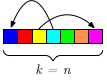
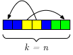
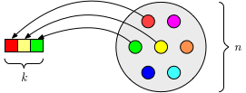
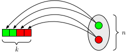
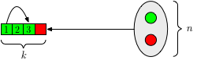
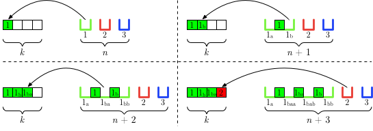
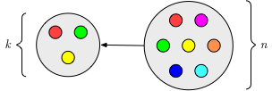
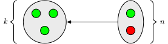

Overview of the most important concepts of combinatorics.

The branch of combinatorics treated here is called **enumerative combinatorics**, which is the counting of the different **arrangements** of the elements of a finite set.

The main arrangements of enumerative combinatorics are **permutations**, **variations**, and **combinations.**

# Contents

- TOC
{:toc .toc-depth-2 .toc-skip-first}

# Primer: Set vs. Tuple vs. Multiset

## Set

- Collection of elements that is **unordered** and has **no duplicate** elements.
- Notation: curly braces $\\\{\\\}$
- Example: $\\{3,5,7\\}$
- Unorderedness: $\\{3,5,7\\}$ is the same as $\\{7,5,3\\}$ is the same as $\\{5,3,7\\}$, etc.

## Tuple

- Collection of elements that is **ordered** (i.e. a sequence) and may have **duplicate** elements.
- A tuple of size $n$ is called an $n$-tuple.
- Notation: parentheses $()$
- Example: $(3,5,5,7)$
- Orderedness: $(3,5,5,7)$ is different from $(3,5,7,5)$ is different from $(3,7,5,5)$, etc.

## Multiset

- Collection of elements that is **unordered** and may have **duplicate** elements.
- The number of occurrences of a specific element is called its *multiplicity*.
- Notation: curly braces $\\{\\}$
- Example: $\\{3,5,5,7\\}$
    - 5 has a multiplicity of 2
    - 3 and 7 have a multiplicity of 1
- Unorderedness: $\\{3,5,5,7\\}$ is the same as $\\{3,5,7,5\\}$ is the same as $\\{3,7,5,5\\}$, etc.

$$
\newcommand{\bi}[1]{\textbf{\textit{#1}}}
\newcommand{\B}[1]{\textbf{#1}}
\newcommand{\lr}{$\,\longrightarrow\,$}
\newcommand{\Cl}[1]{\textcolor{blue}{#1}}
\newcommand{\bs}[1]{\boldsymbol{#1}}
\newcommand{\mr}[1]{\mathrm{#1}}

\newcommand{\MyArrow}[1]{
  \;\xrightarrow{\text{#1}}\;
}
$$

# Permutations

$$
\mr{Set/Multiset} \MyArrow{arrange} \mr{Sequence}
$$

Remember: in a sequence the order matters.

- Arrangement of the elements of a set or multiset of size $n$ into a sequence of length $n$.
- From Latin *permutare*: interchange, swap
    - Think of **shuffling** a collection of elements

## "Normal" Permutations

{:.center-image}

Arrangement of all the elements of a set of $n$ elements into a sequence of $n$ elements.

### Example

- Set: $\\{1,2,3\\}$
- Permutations: $(1,2,3), \, (1,3,2), \, (2,1,3), \, (2,3,1), \, (3,1,2), \, (3,2,1)$
- Number of permutations: 6

### Formula

$$n!$$

### Explanation

- For first position of sequence: $n$ choices; for second position: $n-1$ choices, etc.
- $n \cdot (n-1) \cdot (n-2) \cdot ... \cdot 1 = n!$

### Application

- Calculate the number of ways the letters of the word JOURNAL can be rearranged.
- Set: $\\{J, O, U, R, N, A, L\\}$
    - $n = 7$
- Number of rearrangements:

$$7! = 5040$$

## Permutations With Multisets

{:.center-image}

- Special case of permutation where the collection of elements may contain multiple similar elements (i.e. it is a multiset instead of a set).
- Takes into account the indistinguishability of the different relative arrangements of the elements with multiplicity $>1$.

**Note:**

We denote the multiplicities of the elements of a multiset as $m_1, m_2, ..., m_s$.

### Example 1

- Multiset: $\\{1,1,2\\}$
    - $n = 3$
    - $m_1 = 2$ $\;$ (1 has multiplicity 2)
    - $m_2 = 1$ $\;$ (2 has multiplicity 1)
- Distinct permutations: $(1,1,2), \, (1,2,1), \, (2,1,1)$
- Number of distinct permutations: 3

### Example 2

- Multiset: $\\{f,o,o,f\\}$
    - $n = 4$
    - $m_1 = 2$ $\;$ ($f$ has multiplicity 2)
    - $m_2 = 2$ $\;$ ($o$ has multiplicity 2)
- Distinct permutations: $(f,o,o,f), \, (f,o,f,o), \, (f,f,o,o), \, (o,f,f,o), \, (o,f,o,f), \, (o,o,f,f)$
- Number of distinct permutations: 6

### Formula

$$\binom{n}{m_1, m_2, ..., m_s} = \frac{n!}{m_1! \cdot m_2! \cdot ... \cdot m_s!}$$

The term $\binom{n}{m_1, m_2, ..., m_s}$ is called the **multinomial coefficient**.

### Explanation

- First, calculate number of all possible permutations (including indistinguishable ones):

$$n!$$

- Then, calculate for each group of indistinguishable elements the number of (indistinguishable) permutations:

$$m_i!$$

- Finally, remove total of indistinguishable permutations from the total number of permutations:

$$\frac{n!}{m_1! \cdot m_2! \cdot ... \cdot m_s!}$$

### Application

- Calculate the number of distinct permutations of the word *mississippi*.
- Multiset: $\\{m,i,s,s,i,s,s,i,p,p,i\\}$
    - $n = 11$
    - $m_1 = 1$ $\;$ ($m$ has multiplicity 1)
    - $m_2 = 4$ $\;$ ($i$ has multiplicity 4)
    - $m_3 = 4$ $\;$ ($s$ has multiplicity 4)
    - $m_4 = 2$ $\;$ ($p$ has multiplicity 2)
- Number of permutations:

$$\binom{11}{1,4,4,2} = \frac{11!}{1! \cdot 4! \cdot 4! \cdot 2!} = 34\,650$$

# Variations

$$
\mr{Set} \MyArrow{select and arrange} \mr{Sequence}
$$

Remember: in a sequence the order matters.

- Arrangement of $k$ elements from a set of $n$ elements into a sequence of length $k$.
- Variations without repetition
    - $k < n$
    - If $k = n$, then it is a permutation
- Variations with repetitions
    - $k < n$ or $k = n$ or $k > n$

**Note:**

In the English literature, the term "variation" is archaic, and variations are seen as a type of permutation. On the other hand, in the non-English literature, the distinction between permutation and variation is still commonly made.

## Variations Without Repetitions (k-Permutations of n)

{:.center-image}

- Arrangement of $k$ elements of a set of $n$ elements into a sequence of length $k$.
- Known as **$\bs{k}$-permutations of $\bs{n}$** in the English literature.
- $k < n$
    - If $k = n$, then it is a permutation.
- Notation: $P(n,k)$
- Calculator button: nPr

### Example

- $n=4, \, k=2$
- Set: $\\{1,2,3,4\\}$
- $k$-permutations: $(1,2), \, (1,3), \, (1,4), \, (2,1), \, (2,3), \, (2,4), \, (3,1), \, (3,2), \, (3,4), \, (4,1), \, (4,2), \, (4,3)$
- $P(n,k) = 12$

### Formula

$$P(n,k) = (n)_k = \underbrace{n \cdot (n-1) \cdot ... \cdot (n-k+1)}_{k\:\mr{times}} =  \frac{n!}{(n-k)!}$$

The term $(n)_k$ is called the **falling factorial**.

### Explanation

- Idem permutation, but stop choosing elements after $k$ elements.
- For example, only $4 \cdot 3$ instead of $4 \cdot 3 \cdot 2 \cdot 1$
- Calculate full factorial (e.g. $4 \cdot 3 \cdot 2 \cdot 1$) and get rid of excess part (e.g. $2 \cdot 1$) by dividing by it (e.g. $\frac{4 \cdot 3 \cdot 2 \cdot 1}{2 \cdot 1} = \frac{4!}{2!}$)

## Variations With Repetitions (k-Tuples)

{:.center-image}

- Arrangement of $k$ elements from a set of $n$ elements into a sequence of length $k$, where each element of the set may be chosen multiple times.
- Known as **$\bs{k}$-tuples** in the English literature.
- $k < n$ or $k = n$ or $k > n$
- In many cases, the elements of the set can be thought of as classes from which multiple objects can be instantiated.
- Can also be seen as forming words of length $k$ over an alphabet of size $n$.

### Example 1

- Set: $\\{a,b,c\\}$
    - $n = 3$
- $k = 2$
- Words: $(a,a), \, (a,b), \, (a,c), \, (b,a), \, (b,b), \, (b,c), \, (c,a), \, (c,b), \, (c,c)$
- Number of words: 9

### Example 2

- Set: $\\{0, 1\\}$
    - $n = 2$
- $k = 3$
- Words: $(0,0,0), \, (0,0,1), \, (0,1,0), \, (0,1,1), \, (1,0,0), \, (1,0,1), \, (1,1,0), \, (1,1,1)$
- Number of words: 8

### Formula

$$n^k$$

### Explanation

- For each of the $k$ positions in the sequence we can choose from all the $n$ elements of the set.

### Application 1

- Calculate the number of codes of a combination lock with four rings and 10 digits on each ring.
- Set: $\\{0,1,2,3,4,5,6,7,8,9\\}$
    - $n = 10$
- $k = 4$
- Number of codes:

$$10^4 = 10\,000$$

### Application 2

- Calculate the number of barcodes with a length of 10 bars that can be constructed with bars of three different thicknesses.
- Set: $\\{thin, medium, thick\\}$
    - $n = 3$
- $k = 10$
- Number of barcodes:

$$3^{10} = 59\,049$$

### Application 3

- Calculate the number of ways that Alice, Bob, Charlie, and Dave can stay in the hotels Hilton and Ritz.
    - For example, "all of them staying in Hilton, and nobody staying in Ritz", or "Alice, Bob, and Charlie staying in Hilton, and Dave staying in Ritz", and so on.
- Set: {Hilton, Ritz}
    - $n = 2$
- $k = 4$ $\;$ (Alice, Bob, Charlie, Dave)
- Number of possibilities:

$$2^4 = 16$$

- Note that the function of the "orderedness" here is to identify the individual persons: each position in the sequence corresponds to a specific person.
    - For example, $(\mr{H},\mr{H},\mr{H},\mr{R})$ means Alice, Bob, and Charlie stay in Hilton, and Dave stays in Ritz.
    - This is not the same as e.g. $(\mr{R},\mr{H},\mr{H},\mr{H})$, which means that Alice stays in Ritz, and Bob, Charlie, and Dave stay in Hilton.
- This example can also be seen as putting $k = 4$ distinct balls into $n = 2$ boxes.
- See Application of [Variations With Repetitions Plus Permuations or Repeated Elements](#variations-with-repetitions-plus-permutations-of-repeated-elements) and Application 4 of [Combinations With Repetitions](#combinations-with-repetitions).

## Variations With Repetitions Plus Permutations of Repeated Elements

{:.center-image}

- Arrangement of a sequence of length $k$ from a set of $n$ elements where each element of $n$ may be chosen multiple times **AND** considering of the permutations of the repeated elements in the sequence.
- $k < n$ or $k = n$ or $k > n$

### Example

- Set: $\\{1,2\\}$
    - $n = 2$
- $k = 2$
- Variations: $(1_a,1_b), \, (1_b,1_a), \, (1,2), \, (2,1), \, (2_a,2_b), \, (2_b,2_a)$
- Number of variations: 6
- Note that without the additional constraint of taking into account the permutations of the repeated elements, there would be $2^2 = 4$ variations (variations with repetitions):
    - $(1,1), \, (1,2), \, (2,1), \, (2,2)$
- However, two of these sequences contain repeated elements and thus we must replace them with a series of sequences containing all the permutations of all the groups of repeated elements.

Forming the permutations of the repeated elements in the sequence is one way of thinking about this case. However, it does not lead easily to a formula, because it is hard to generally tell how many repeated elements are in each sequence. There is another way of thinking about this case, which is described below, which naturally leads to the below formula.

### Formula

$$n^{(k)} = \underbrace{n \cdot (n+1) \cdot ... \cdot (n+k-1)}_{k\:\mr{times}}$$

The term $n^{(k)}$ is called the **rising factorial** (also known as Pochhammer function).

### Explanation

{:.center-image}

- Think of $n$ boxes and $k$ objects, and putting the objects in the boxes, which translates to choosing a position in one of the boxes for each object.
- For the first object, there are $n$ positions to choose from in the $n$ boxes (one possible position in each box).
- In the box that has been chosen, there are now two positions for another object in this box:
    - One "to the left" of the object already in the box, and one "to the right" of the object already in the box.
- Thus, for the second object, there are now $n+1$ positions to choose from.
- Whatever position in whatever box is chosen, it gives rise to to new positions: one to the left and one to the right of the chosen position.
- Thus for the third object, there are $n+2$ positions to choose from.
- This repeats $k$ times for each object in the sequence.

### Application

- In how many ways can Alice, Bob, Charlie, and Dave check in at the hotels Hilton and Ritz if the order in which the people ckeck in in each hotel matters?
    - For example, if Alice and Bob stay at Hilton, "Bob checking in before Alice", and "Bob checkin in after Alice" are two different cases.
- Set: {Hilton, Ritz}
    - $n = 2$
- $k = 4$ $\;$ (Alice, Bob, Charlie, Dave)
- Number of possibilities:

$$2^{(4)} = 2 \cdot 3 \cdot 4 \cdot 5 = 120$$

- Note that an individual possibility might look like this: $(\mr{H}, \mr{R}, \mr{R_{a}}, \mr{R_{ab}})$
    - This means that Alice stays in Hilton, and Bob, Charlie, and Dave stay in Ritz, and the order of check in at Ritz is first Charlie, then Dave, then Bob.
- The above possibility is different from e.g. $(\mr{H}, \mr{R}, \mr{R_{a}}, \mr{R_{b}})$
    - Here also, Alice stays in Hilton, and Bob, Charlie and Dave stay in Ritz, but the order of check in at Ritz is first Charlie, then Bob, then Dave.

# Combinations

$$\mr{Set} \MyArrow{select} \mr{Set/Multiset}$$

Remember: in a set or multiset, the order doesn't matter.

- Selection of $k$ elements of a set of $n$ elements into a new set (combinations without repetition) or multiset (combinations with repetition) of $k$ elements.
- Combinations without repetition
    - $k \leq n$
    - If $k = n$, there is only a single combination
- Combinations with repetition
    - $k < n$ or $k = n$ or $k > n$

## Combinations Without Repetitions

{:.center-image}

- Selection of a subset of $k$ elements of a set of $n$ elements.
- $k \leq n$
    - If $k = n$, there is only a single combination
- Say "$n$ choose $k$"
- Notation: $C(n,k)$
- Calculator button: nCr

### Example

- Set: $\\{1,2,3\\}$
    - $n = 3$
- $k = 2$
- Combinations: $\\{1,2\\}, \, \\{1,3\\}, \, \\{2,3\\}$
- $C(3,2) =  3$

### Formula

$$C(n,k) = \frac{P(n,k)}{k!} = \frac{n!}{(n-k)! \cdot k!} = \binom{n}{k}$$

The term $\binom{n}{k}$ is called the **binomial coefficient**.

### Explanation

- Consider the number of variations (sequences) of length $k$: $P(n,k) = \frac{n!}{(n-k)!}$
- This includes $k!$ sequences consisting of the same $k$ elements (for each subset of $k$ elements)
- Since for combinations the order doesn't matter, all these $k!$ sequences constitute the same combination.
- Thus, by dividing the number of variations by $k!$, we obtain the number of combinations.

$$C(n,k) = \frac{P(n,k)}{k!} = \frac{n!}{(n-k)!} \cdot \frac{1}{k!} = \frac{n!}{(n-k)!\cdot k!}$$

### Symmetry Property

$$\binom{n}{k} = \binom{n}{n-k}$$

Because:

*a)*

$$\binom{n}{k} = \frac{n!}{(n-k)! \cdot k!}$$

*b)*

$$
\begin{align*}
    \binom{n}{n-k} &= \frac{n!}{(n-(n-k))! \cdot (n-k)!} \\
                   &= \frac{n!}{(n-n+k)! \cdot (n-k)!}\\
                   &= \frac{n!}{k! \cdot (n-k)!}
\end{align*}
$$

**Rationale:** choosing is binary, so *choosing* $k$ of $n$ elements is the same as choosing to *not choose* the other $n-k$ elements.

### Application 1

- Calculate the number of 6-number combinations in the lottery with 49 numbers to choose from.
- Set: $\\{1,2,3,4,...,49\\}$
    - $n = 49$
- $k = 6$
- Number of 6-number combinations:

$$C(49,6) = \binom{49}{6} = \frac{49!}{43! \cdot 6!} = 13\,983\,816$$

### Application 2

- Calculate the number of ways to put three balls in five boxes so that each box contains at most one ball (i.e. each box contains either 0 or 1 ball).
- Set: $\\{\mr{box}_1,\mr{box}_2,\mr{box}_3,\mr{box}_4,\mr{box}_5\\}$
    - $n = 5$
- $k = 3$
- Think of choosing a subset of size 3 of the five boxes. The chosen boxes contain a ball, and all the other boxes contain no ball.

- Number of ways:

$$C(5,3) = \binom{5}{3} = \frac{5!}{2! \cdot 3!} = 10$$

## Combinations With Repetitions

{:.center-image}

- Selection of $k$ elements from a set of $n$ elements, and every element may be selected multiple times.
- The resulting combination is a **multiset** of size $k$.
- $k < n$ or $k = n$ or $k > n$
- Think of the $n$ elements of the set not as objects, but as classes that can be instantiated.
- Say "$n$ multichoose $k$".

### Example 1

- Set: $\\{1,2,3\\}$
    - $n = 3$
- $k = 2$
- Combinations: $\\{1,2\\}, \, \\{1,3\\}, \, \\{2,3\\}, \, \\{1,1\\}, \, \\{2,2\\}, \, \\{3,3\\}$
- Number of combinations: 6

### Example 2

- Set: $\\{1,2\\}$
    - $n = 2$
- $k = 4$
- Combinations: $\\{1,1,1,1\\}, \, \\{1,1,1,2\\}, \, \\{1,1,2,2\\}, \, \\{1,2,2,2\\}, \, \\{2,2,2,2\\}$
- Number of combinations: 5

### Formula

$$\left(\!\!\binom{n}{k}\!\!\right) = \binom{n+k-1}{k}$$

### Explanation

$$
\begin{align}
    \left(\!\!\binom{n}{k}\!\!\right) &=  \binom{n+k-1}{n-1} \\
    &= \frac{(n+k-1)!}{(n-1)! \cdot k!} \\
    &= \binom{n+k-1}{k}
\end{align}
$$

**Line 1**

States that counting the combinations of $k$ of $n$ elements *with* repetition is the same as counting the combinations of $n-1$ of $n+k-1$ elements *without* repetition.

This can be demonstrated with the **stars and bars** representation:

- We put **$\bs{k}$ stars** in a line, representing the $k$ elements to choose
- Between the stars we position **$\bs{n-1}$ bars**, partitioning the stars into $n$ segments
- Each arrangement of stars and bars corresponds to a combination with repetition
- For example, with the set $\\{a,b,c\\}$ ($n=3$), and $k=4$, a possible arrangement is: `*||***`
    - This specific arrangement corresponds to the combination $\\{a,c,c,c\\}$:
        - Segment 1 (corresponding to element $a$) has 1 star (i.e. chosen 1 time)
        - Segment 2 (corresponding to element $b$) has 0 stars (i.e. chosen 0 times)
        - Segment 3 (corresponding to element $c$) has 3 stars (i.e. chosen 3 times)
- In total, there are **$\bs{k+n-1}$ elements** in a line (stars and bars together)
- Positioning the bars is equivalent to choosing $n-1$ out of the $k+n-1$ elements to be bars
- Thus, $\binom{n+k-1}{n-1}$ gives the number of arrangements of stars and bars, which is equivalent to the number of $k$-combinations of $n$ *with* repetition.

**Line 2**

Expansion of the binomial coefficient.

**Line 3**

An alternative binomial coefficient representation of the formula on line 2 (swapping the "meaning" of the factors in the denominator).

As can be seen, the formulas on line 1 and 3 are equivalent, but the formula on line 3 is more commonly used.

### Application 1

- Calculate the number of possible colour combinations resulting from grabbing 10 gummy bears out of a large bag containing gummy bears in 5 colours.
- Set: $\\{white, green, red, orange, yellow\\}$
    - $n = 5$
- $k = 10$
- Number of combinations:

$$\left(\!\!\binom{5}{10}\!\!\right) = \binom{5+10-1}{10} = \binom{14}{10} = \frac{14!}{4! \cdot 10!} = 1001$$

### Application 2

- Calculate the number of possible combinations of faces resulting from rolling three dice at once. 
- Set: $\\{1,2,3,4,5,6\\}$
    - $n = 6$
- $k = 3$
- Number of combinations:

$$\left(\!\!\binom{6}{3}\!\!\right) = \binom{6+3-1}{3} = \binom{8}{3} = \frac{8!}{5! \cdot 3!} = 56$$

### Application 3

- Calculate the number of ways to put three balls in five boxes, if the only thing that matters is how many balls are in each box (i.e. 0, 1, 2, or 3).
- Set: $\\{\mr{box}_1,\mr{box}_2,\mr{box}_3,\mr{box}_4,\mr{box}_5\\}$
    - $n = 5$
- $k = 3$
- Think of forming sub-multisets of size 3 of the five boxes (a multiset may contain multiple times the same box).
- If we choose three times $\mr{box}_1$, then $\mr{box}_1$ contains three balls, and all other boxes contain no ball, and so on.
- Number of ways:

$$\left(\!\!\binom{5}{3}\!\!\right) = \binom{5+3-1}{3} = \binom{7}{3} = \frac{n!}{4! \cdot 3!} = 35$$

### Application 4

- Calculate the number of ways that four persons can stay in the two hotels Hilton and Ritz, if the only thing that matters is the number of persons staying in each hotel.
    - For example, "4 persons staying in Hilton and 0 in Ritz", or "3 persons staying in Hilton, and 1 in Ritz", and so on.
- Set: {Hilton, Ritz}
    - $n = 2$
- $k = 4$ $\;$ (4 persons)
- Number of possibilities:

$$\left(\!\!\binom{2}{4}\!\!\right) = \binom{2+4-1}{4} = \binom{5}{4} = \frac{5!}{1! \cdot 4!} = 5$$

- Think of forming sub-multisets of size 4 of the set {Hilton, Ritz}.
    - In this case, each sub-multiset *must* contain multiple occurrences of at least one element.
    - The number of times an element occurs in the sub-multiset is the number of persons staying in this hotel.
- See Application 3 of [Variations With Repetitions](#variations-with-repetitions-k-tuples) and Application of [Variations With Repetitions Plus Permutations of Repeated Elements](#variations-with-repetitions-plus-permutations-of-repeated-elements).
