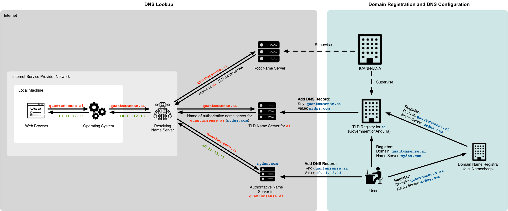

An overview of how the Domain Name System (DNS) works. It includes a step-by-step explanation of DNS lookups, and a section on domain registration and DNS configuration.

# Contents

- TOC
{:toc .toc-skip-first}

# Illustration

[{:width="100%"}](assets/dns.png){:.image-link}

# DNS Lookup

The DNS translates hostnames, like `quantumsense.ai` to IP addresses. Here is how a translation of the hostname `quantumsense.ai` to an IP address of a webserver works (this corresponds to the left part of above illustration):

## 1. Web Browser

The **web browser** asks the operating system for the IP address of `quantumsense.ai`.

## 2. Operating System
The **operating system** checks its cache. If it has no cached entry for `quantumsense.ai`, it asks a pre-configured resolving name server for the IP address of `quantumsense.ai`.

## 3. Resolving Name Server

The **resolving name server** that the operating system contacts is typically operated by the Internet Service Provider (ISP) or organisation (company, university) of the network that the machine is connected to. You can find out which resolving name servers are currently configured in your operating system with:

~~~bash
scutil --dns | grep 'nameserver\[[0-9]*\]'
~~~

The resolving name servers knows one thing: the IP address of a root name server. So, after checking its cache for an entry of `quantumsense.ai`, the resolving name server asks the root name server for the IP address of `quantumsense.ai`.

## 4. Root Name Server

The **root servers** are a network of hundreds of servers around the world that is supervised by the Internet Assigned Numbers Authority ([IANA](https://www.iana.org/)). IANA is a department of the Internet Corporation for Assigned Names and Numbers ([ICANN](https://www.icann.org/)).

The root servers are operated by different organisations, such as research institutions, companies, governments, universities, and ICANN itself. Here is some information from IANA about the [root servers](https://www.iana.org/domains/root/servers). And here is a [map](http://www.root-servers.org/) showing where all the root servers are located and who operates them.

A root server has to know one thing: the name of a top-level domain (TLD) name server for each existing TLD.

There exist two main types of TLDs: generic TLDs (gTLD) and country-code TLDs (ccTLDs). Country-code TLDs consist of two letters, and generic TLDs consist of three or more letters.

Here, IANA lists all existing [TLDs](https://www.iana.org/domains/root/db) along with the TLD registry who manages this TLD.

The root server doesn't know the IP address of `quantumsense.ai`, however, as mentioned, it knows the name of an `ai` TLD name server, which it returns to the resolving name server. This is going to allow the resolving name server to ask this `ai` TLD name server for the IP address of `quantumsense.ai`.

## 5. TLD Name Server

The **TLD name servers** are operated by the TLD registry of each TLD (which are listed in the [list](https://www.iana.org/domains/root/db) already linked to above). 

A TLD registry manages all the domain name registrations under its TLD. The TLD registry determines the prices and conditions for a domain registration. For example, if you want to register the domain `example.com`, you have to do this with the TLD registry for `com`, which is [VeriSign](https://www.verisign.com/). Or if you want to register the domain `example.ca`, you have to go to the TLD registry of `ca`, which is the Canadian Internet Registration Authority ([CIRA](https://cira.ca/)).

Note that actually you don't have to go to the TLD registry directly, because there are retailing companies that are called **domain name registrars**. Examples are [Namecheap](https://www.namecheap.com/), [GoDaddy](https://godaddy.com), or [Marcaria](https://www.marcaria.com). These companies handle the interaction with the official TLD registry for you, and you can typically register domains of different TLDs with them.

So, in the case of `quantumsense.ai`, the IANA [TLD list](https://www.iana.org/domains/root/db/ai.html) reveals that the registry for the `ai` TLD is the [Government of Anguilla](http://www.gov.ai/) (because `ai` is the ccTLD of Anguilla). This means that the name the resolving name server received from the root name server belongs to a TLD name server operated by the Government of Anguilla. You can see the current TLD name servers for the `ai` TLD [here](https://www.iana.org/domains/root/db/ai.html) in the IANA TLD list.

The `ai` TLD name server doesn't know the IP address of `quantumsense.ai`, but what it know is the name of a name server that is responsible for the `quantumsense.ai` domain. It thus returns this name of this name server to the resolving name server. This will finally allow the resolving name server to get the IP address of `quantumsense.ai`.

If you wonder how the `ai` TLD name server knows a name server that is responsible for the `quantumsense.ai` domain, this will be explained the [next section](#domain-registration-and-dns-configuration).

## 6. Authoritative Name Server

The name server that was returned by the `ai` TLD name server to the resolving name server is an **authoritative name server** for the `quantumsense.ai` domain. This means that it hosts the mapping of this domain name to an IP address (that was installed there by the user). So, at this point, there are no more redirections to other name servers, but the authoritative name server directly returns the IP address of `quantumsense.ai` to the resolving name server.

Name servers that are authoritative for sub-TLD zones (like `quantumsense.ai` or `foo.mydomain.com`) can be operated by anyone. You can run one yourself for your domain. The only condition is that it runs on a machine that is connected to the Internet. Here is an example of how to [run your own DNS server](https://zwischenzugs.com/2018/01/26/how-and-why-i-run-my-own-dns-servers/).

Most of the time, however, these types of name servers are operated by different types of companies and organisations.

Examples are:

- Dedicated DNS hosting companies, such as [ns1](https://ns1.com/), [DNSimple](https://dnsimple.com/), [DNS Made Easy](https://dnsmadeeasy.com/), [FreeDNS](https://freedns.afraid.org/), or [Google Cloud DNS](https://cloud.google.com/dns/).
- Domain name registrars, such as [Namecheap](https://www.namecheap.com/), [GoDaddy](https://godaddy.com), or [Marcaria](https://www.marcaria.com). These companies provide DNS hosting as an additional service to their core business (the registration of domain names).
- Some TLD registries, such as [CIRA](https://cira.ca/). These are typically the TLD registries that allow to register domain names directly with them. Not all TLD registries do this, many refer users to domain name registrars.
- Web hosting providers , and some TLD registries, such [DreamHost](https://www.dreamhost.com/) and many others. These companies typically provide domain name registration and DNS hosting as an additional service to their core business (website hosting).

Wherever the authoritative name server, whose name was returned by the TLD name server, runs, and whoever manages it, this name server now can finally return the IP address of `quantumsense.ai` to the resolving name server.

## 7. Back to the Web Browser

So, finally the resolving name server got the desired IP address of `quantumsense.ai`. It passes it back to the operating system, which in turn passes it back to the web browser.

## Notes

Clearing up some things that might be bugging you.

### Caching

During this entire journey, the resolving name server stores all the IP addresses it finds out (of the `ai` TLD name server, of the `quantumsense.ai` authoritative name server, and of the `quatumsense.ai` domain) in its cache. In this way, it can answer any future requests to one of these domain names immediately.

And also the operating system and the web browse store the IP address of `quantumsense.ai` in their DNS cache. In this way, when the user requests a page of the same website again (for example, by navigating to another page), the browser knows the corresponding IP address immediately, and no further lookups are necessary.

The amount of time that these DNS records are maintained in cache by these entities is called Time To Live ([TTL](https://en.wikipedia.org/wiki/Time_to_live#DNS_records)). When the TTL expires, the record is removed from the cache, and it has to be looked up again. This ensures that when a record on a name sever changes (for example, the IP address associated with a certain domain changes), this change will eventually propagate to the client side.

### Hierarchical Structure

An important observation about DNS is that it's **hierarchical.** On each so-called zone, the name servers know just the name of another name server that is responsible for the next-deeper zone of the domain name. It is only the name servers corresponding to the deepest zone of a domain name, that know the concrete IP address of this domain.

In the provided example, the number of zones is 3 (root zone, `ai` TLD zone, and `quantumsense.ai` zone). However, this number is not restricted to 3, but it can be anything.

If you are the owner of a domain, say `mydomain.com`, then you are basically the registry for this domain. You could sell sub-domains to other people, if you want, such as `foo.mydomain.com` and `bar.mydomain.com`.

You would still need to maintain a name server for `mydomain.com`, and you have to provide the name of this name server to the `com` TLD registry. However, at the same time, you are responsible for any DNS requests for a `*.mydomain.com` domain. That is, all requests to a `*.mydomain.com` domain go to your `mydomain.com` name server that you indicated to the `com` TLD registry, and you are responsible for handling them. That means you need to require each registrant of a `*.mydomain.com` sub-domain to supply you the name of a name server for this specific sub-domain, so that you can add an appropriate record to your `mydomain.com` name server. Just as the `com` TLD registry does with you!

DNS is designed to work like this on and on, down to any level of depth.

### Resolution of Name Server Responses

One thing must be bugging you: if, say, the `ai` TLD name server returns the name `mydns.com` for the name server that is responsible for `quantumsene.ai`, and the resolving name server now has to contact `mydns.com`, how does the resolving name server find out the IP address of `mydns.com`?

The answer is, by DNS again. The resolving name server basically starts a new DNS query until it finds out the IP address of `mydns.com`, at which point it can continue the resolution of `quantumsense.ai`.

Fortunately, this process can be abbreviated with caching, so that the resolving name server has the IP addresses of certain name servers in its cache and doesn't need to look them up through DNS.

### Glue Records

One problem remains: imagine you own the domain `mydomain.com` and you operate your own authoritative name server for this domain (for example, running in your home or on a computing instance in the cloud). Furthermore, you want this name server to be accessible through `ns.mydomain.com` (because you don't want to register another domain just for your name server).

So, in this case, you would declare `ns.mydomain.com` as the name server for your `mydomain.com` domain to the `com` TLD registry. Now, there's a problem. Imagine some resolving name server (resolver) is resolving `mydomain.com`:

1. The resolver asks the `com` TLD name server for `mydomain.com`.
2. The `com` TLD name server returns `ns.mydomain.com` as the name server responsible for `mydomain.com`.
3. The resolver now has to resolve `ns.mydomain.com`.
4. The resolver ends up again at the `com` TLD name server, asking for `ns.mydomain.com`.
5. The `com` TLD name server returns `ns.mydomain.com` as the name server responsible for `mydomain.com` (and any sub-domains beneath it).

As you can see, the steps  3--5 above form an infinite loop. This is because in order to resolve `mydomain.com`, the resolver first has to resolve `ns.mydomain.com`, but to resolve `ns.mydomain.com`, the resolver first has to resolve `mydomain.com`.

[Glue records](https://help.1and1.com/domains-c36931/manage-domains-c79822/dns-c37586/explanation-of-a-glue-record-a595844.html) resolve this issue. A glue record is simply an IP address associated with a DNS entry.

In the above example, when you declare your name server for your domain `mydomain.com` to the `com` TLD provider, you would declare not only the hostname `ns.mydomain.com`, but the hosts IP address along with it.

So, for example, your glue record declaration would look like:

~~~
ns.mydomain.com 20.21.22.23
~~~

Instead of just a normal name server declaration:

~~~
ns.mydomain.com
~~~

Now, in step 2 above, when the resolver asks the `com` TLD name server for `mydomain.com`, the TLD name server returns not only the name `ns.mydomain.com`, but also the IP address `20.21.22.23`. In this way, the resolver can contact `ns.mydomain.com` directly, without any further DNS lookups, and the infinite loop is avoided.

The disadvantage of a glue record is that there is now a hardcoded IP address in the `com` TLD name servers. That means, if the IP address of your `ns.mydomain.com` name server changes you have to declare this change to the `com` TLD registry, and the change must propagate through all the `com` TLD name servers.

Without glue records, if the IP address of a name server, say `mydns.com`, changes, it has to be updated only in the name servers that are authoritative for `mydns.com`, which are on a lower hierarchy level than the name servers for `com`.

# Domain Registration and DNS Configuration

Reading through the above process, everything seems to make sense, except two points:

1. How does the TLD name server know the name of an authoritative name server for a given domain name?
    - For example, how does the `ai` TLD name server know the authoritative name server for `quantumsense.ai`?
2. How does an authoritative name server know the IP address that belongs to a given domain name?
    - For example, how does the authoritative name server of `quantumsense.ai` know the IP address belonging to this domain?

The following two subsections answer these question (note that this section corresponds to the right part of the illustration at the beginning).

## Configure TLD Name Server

The answer to question 1 above is as follows: when you register a domain name, you are required to provide the names of two name servers that are authoritative for your domain to the registrar. The registrar passes this information to the TLD registry, and the TLD registry adds an appropriate record to its name servers.

In this way, for any domain that has been registered under a given TLD, the TLD name servers know a name sever that is responsible for this domain, and they can refer requests accordingly.

Note that the number of name servers that you have to provide to a TLD registry is usually at least two. This is to provide redundancy in the case one of the name servers fails.

You can review at any time the name servers that you registered with your domain name at your TLD registry with the `whois` command:

~~~bash
whois mydomain.com
~~~

## Configure Authoritative Name Server

The answer to question 2 above is as follows: well, you directly configure the authoritative name server with your domain and an IP address.

DNS servers are configured by adding so-called **DNS records**. These are simple key-value pairs where the key is a domain name. Here is a list of the most common [DNS records](https://support.marcaria.com/hc/en-us/articles/215527983-What-are-DNS-records-). Wikipedia also has a full list of [all DNS records](https://en.wikipedia.org/wiki/List_of_DNS_record_types).

For simply mapping a domain name to an IP address, you can add an **A record**. An A record has a domain name as its key and an IP address as its value.

For example, if you have a GitHub Pages website that you want to be accessible under your custom domain, you have to add an A record with your domain and an IP address provided by GitHub Pages to to the DNS server that you provided to your TLD registry when you registered the domain. As mentioned, this name server may be either run by your TLD registry, by your domain name registrar, by a web hosting provider, by a DNS hosting provider, or even by yourself. The important thing is that you are able to add the required records to this DNS server.

# References

- Here's a [comic](https://howdns.works/) explaining how DNS works. Don't miss the bonus part on glue records.
