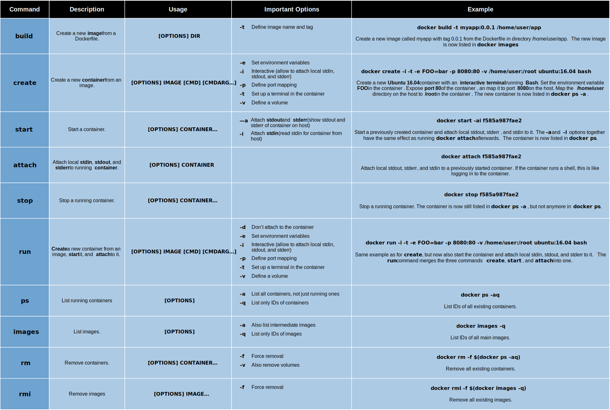

A cheatsheet for some of the most common basic [Docker](https://www.docker.com/) commands.

# Transformations of the most basic commands

[{:width="75%" .center-image}](assets/docker-cheatsheet-1.svg){:.image-link}

# Usage and examples of basic commands

[{:width="100%"}](assets/docker-cheatsheet-2.pdf){:.image-link}
