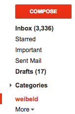

Everybody can register a domain name (e.g. *weibeld.net*) with a domain name registrar like Namecheap, and use this domain name for a website. But what about an e-mail address with this domain? Is it also possible to send and receive e-mails from e.g. *info@weibeld.net*?

The answer is, yes, it is possible, but services that allow this are usually paid. For example, it can be done with Google's [G Suite](https://gsuite.google.com/products/gmail/), but it costs at least \$5 per month. 

Here is a way to achieve the same for completely **free**. It works by combining the two free services [Gmail](https://mail.google.com/) and [Mailgun](https://www.mailgun.com/).

These instructions assume that you have a Gmail account. If you don't have one, just create one.

# Goal

- Receive emails to an address with a custom domain (e.g. *info@weibeld.net*) to Gmail
- Send emails with this domain from Gmail

# Procedure

1. Register domain with [Namecheap](https://www.namecheap.com/) (or another registrar, but it's easy with Namecheap)
2. Add domain to [Mailgun](https://www.mailgun.com/)
3. Set up DNS records on Namecheap according to instructions of Mailgun
4. In Mailgun, forward incoming emails to Gmail (create a *Route*)
5. In Mailgun, create SMTP credentials for the domain (for sending emails)
6. In Gmail, *"add another email address you own"* and set up with Mailgun SMTP credentials

# Notes

- Do not create a subdomain for Mailgun (e.g. *mailgun.weibeld.net*) as recommended by Mailgun. This is only necessary if emails to *weibeld.net* are to be received to multiple providers (i.e. Mailgun and some other email provider).
- For the DNS entries in Namecheap:
    - Omit the top and 2nd-level domain names (e.g. omit `weibeld.net`)
    - Use `@` to specify the top and 2nd-level domain names (e.g. `@` means `weibeld.net`)

# Caveats

- I noticed that when you reply to an e-mail with your custom domain e-mail address, it takes sometimes quite a long time (around 10 minutes) to be delivered.

# Extra: Organise E-Mails in the Gmail Inbox

By default, the e-mails received to your custom domain e-mail address and the e-mails received to your conventional Gmail address are mixed in your Gmail inbox. It would be nice to have them separated, so that you can see all the e-mails received to your custom domain address at a glance.

## What We Can't Do

Gmail doesn't allow to do this in the best possible way, but there is a workaround. The ideal case would be if we could create an additional custom category in the Gmail inbox:

{:.center-image}

And then automatically add all e-mails to the custom domain e-mail address to this category.

Unfortunately, it is **not** possible to create custom categories in Gmail, you can only use the pre-defined ones like *Primary*, *Social*, *Promotions*, *Updates*, and *Forums* (see [here](https://webapps.stackexchange.com/questions/101964/how-do-i-make-a-new-category-on-my-gmail-account)).

## What We Can Do

The workaround is to use **labels**. You can automatically assign a label to all e-mails sent to your custom domain address, and then you can view all the e-mails having this label.

To do this, create a filter that adds a label to incoming e-mails:

1. Click on the *Show search options* triangle in the Gmail search bar
2. In the *To* field, enter your custom domain e-mail address
3. Click *Create filter with this search*
4. Check *Apply the label* and select *New label...*
5. Create a new label (e.g. *weibeld*)
6. Click *Create filter*

Now, all the incoming e-mails matching the filter (i.e. having your custom domain e-mail address as the receiver) get your specified label, and can be viewed by selecting your label in the control panel on the left side:

{:.center-image}

Note that in the *Primary* inbox your e-mails are still mixed, but at least you have the ability to view your custom domain e-mails separated from the other e-mails.

# References

- [Hacking Gmail to use custom domains for free](https://simplyian.com/2015/01/07/Hacking-GMail-to-use-custom-domains-for-free/)
