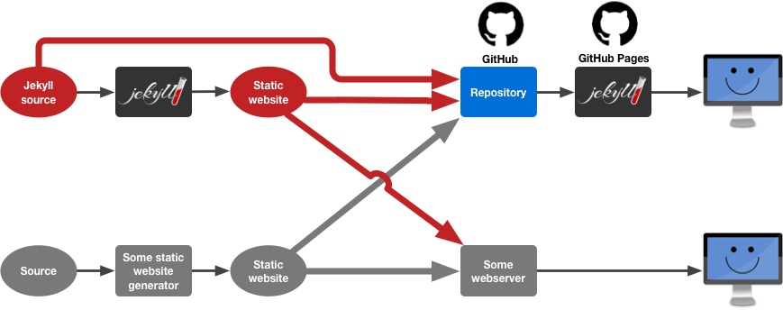

Overview of [GitHub Pages](https://pages.github.com/), the free static website hosting service of GitHub.

# What Is It?

GitHub Pages is a free static website hosting service of GitHub. Every repository can provide one static website that is hosted for free.

The hosting can be enabled for a repository in the *Settings* of the repository.

The source of the static website (that is, which files are considered to be part of the website) can be either set to the *master* branch, the *gh-pages* branch, or to the `docs` folder of the *master* branch. All the files in the selected source location will be processed and served by the webserver.

# How It Works

{:width="100%"}

GitHub Pages runs [Jekyll](https://jekyllrb.com/), a static website generator.

Jekyll converts Jekyll input (a mix of HTML, Markdown, SCSS, YAML configuration files, and [Liquid](https://shopify.github.io/liquid/)) to a ready-to-serve HTML/CSS static website.

Any input that is not Jekyll-specific is copied unmodified to the output directory by Jekyll.

When you push to your GitHub repository, GitHub Pages runs all the files in the specified location (that is, the *master* or *gh-pages* branch, or the `docs` folder of the *master* branch) through Jekyll. The output of Jeykll is served by the webserver.

This can mean two things:

1. If the content of your repository is Jekyll input, it is converted to a static website right there on GitHub, and this static website is served by the webserver
2. If the content of your repository is already a ready-to-serve static website, it is not modified by Jekyll, and all your files are passed "as is" to the webserver

This means, there are several options to publish a website on GitHub Pages (as can be seen in above illustration):

- Create Jekyll input, push the Jekyll input to GitHub, and let GitHub Pages convert it to a static website with Jekyll
- Create Jekyll input, convert it locally to a static website, and push the static website to GitHub
- Create a static website with another static website generator, or manually from scratch, and push it to GitHub
- Of course, you can also publish the static website output that you generated locally with Jekyll on any other webserver

# What's The Address Of My Website?

After pushing to GitHub, the website is accessible under:

~~~
http://username.github.io/repository-name
~~~

## User and Organisation Websites

In addition, every GitHub user and organisation can create **one** static website with the following address:

~~~
http://username.github.io
~~~

In order to create such a user or organisation website, the name of the GitHub repository must be *username.github.io*, and the GitHub Pages source must be set to the *master* branch. This is described [here](https://help.github.com/articles/user-organization-and-project-pages/#user--organization-pages).

