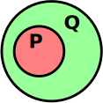

These are some reminders for the intuition of the terms **necessary** and **sufficient** conditions.

# Sets

Consider the following Venn diagram:

{:.center-image}

## Sufficient

- $P$ is a **sufficient** condition for $Q$
    - If an element is in $P$, it **must** also be in $Q$
- $P$ is **not** a necessary condition for  $Q$
    - An element may be in $Q$ without being in $P$

## Necessary

- $Q$ is a **necessary** condition for $P$
    - An element **cannot** be in $P$ without also being in $Q$
- $Q$ is **not** a sufficient condition for $P$
    - If an element is in $Q$, it may or may not be in $P$

# Logic

Consider the following propositional logic formula:

$$
	P \rightarrow Q
$$

## Sufficient

- $P$ is a **sufficient** condition for $Q$
    - If $P$ is true, then $Q$ **must** be true
- $P$ is **not** a necessary condition for $Q$
    - $Q$ may be true if $P$ is false

## Necessary

- $Q$ is a **necessary** condition for $P$.
    - $P$ can **only** be true, if $Q$ is also true
- $Q$ is **not** a sufficient condition for $P$
    - If $Q$ is true, $P$ may be true or false
