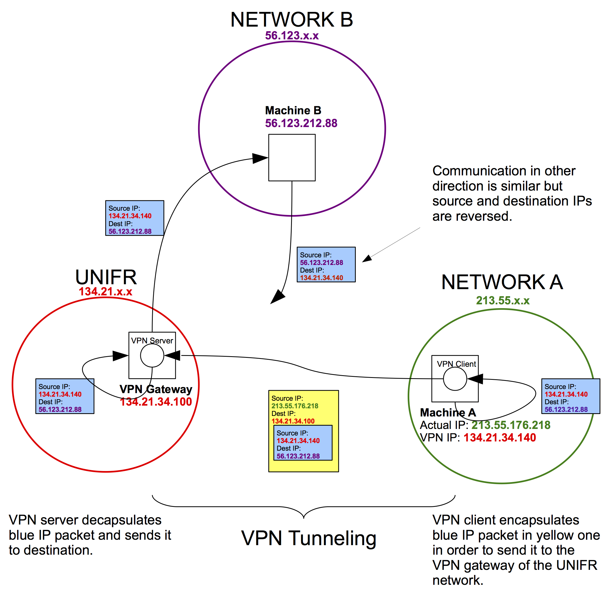

A simple explanation of how VPN tunnelling works, that is, the encapsulation of an IP packet (that will be used later) in another IP packet (that is being used now).

In the below illustration there are the following networks:

- *Network A*: the network of the VPN client (e.g. a student at her home)
- *UNIFR*: the network of the VPN server (e.g. the university network)
- *Network B*: any network in the Internet (e.g. the IEEE publication repository).

As can be seen, for *Network B* it looks as if the request of the student is coming from within *UNIFR*. This might allow the student to access the IEEE publication repository with the license of the university, even though the student is physically located outside of the university network.

[PDF version](assets/vpn-tunnelling.pdf)

{:width="100%"}
