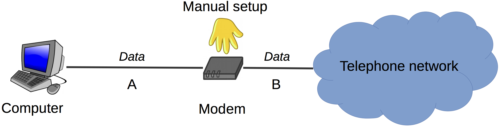
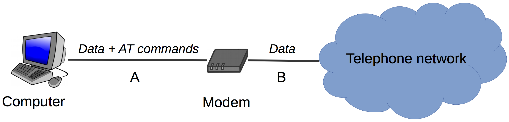
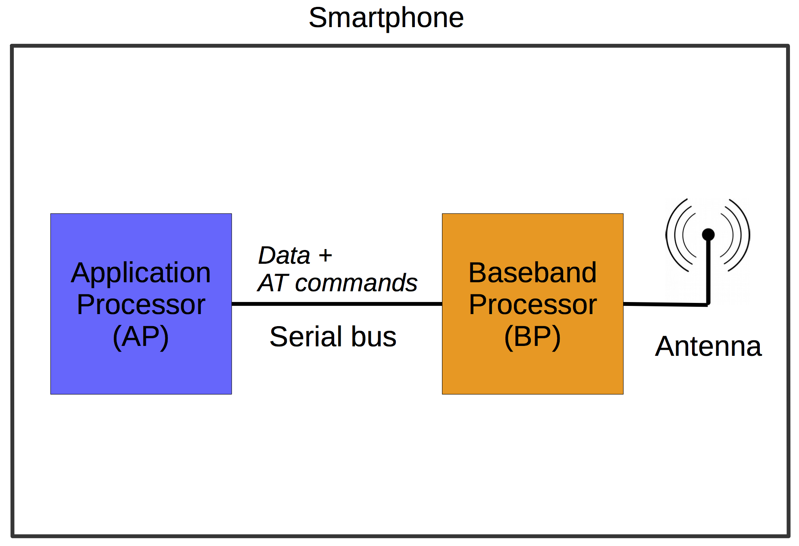
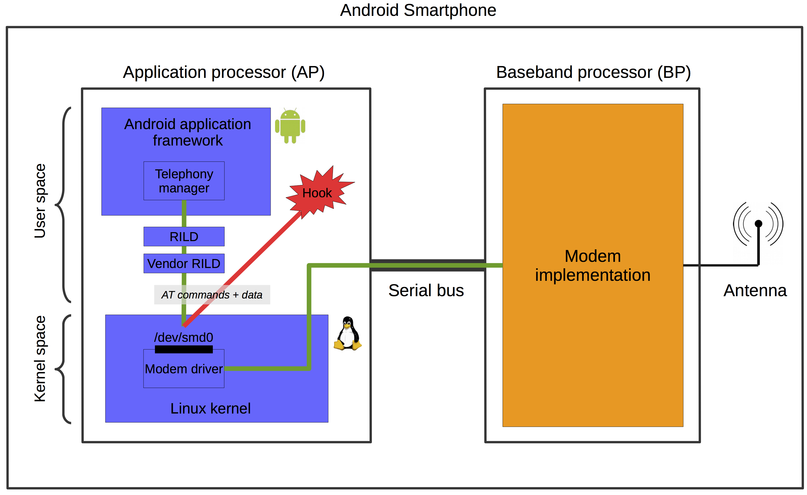

This document explains what AT commands are, and how they can be used to issue direct commands to the baseband processor of a smartphone.

A PDF version of this document can be found [here](assets/at-commands.pdf).

AT Commands Background
======================

AT commands have been introduced in 1981 as a way to control a wired
Internet modem by software. In these times, a modem was basically a
device with two input/output ports. One (*A*) connected to a computer,
and the other (*B*) connected to the telephone network (see
Figure 1).

A typical data exchange in such a setup looks as follows: the computer
sends a piece of information as digital data over line *A*, the modem
transforms it to an analog signal by modulating a carrier signal, which
it sends out over line *B* to the telephone network. Similarly, when the
modem receives an analog signal from the telephone network over line
*B*, it transforms it to digital data by demodulating it, and forwards
the digital data to the computer over line *A*.

{:width="80.00000%"}{:.center-image}
*Figure 1: Manual modem configuration before the introduction of AT commands.*{:.caption}

Before AT commands existed, what flowed through the lines *A* and *B*
was exclusively data. Any modem management tasks, such as for example
setting the phone number to dial, were done manually, directly on the
modem (Figure 1). The novelty introduced by the AT
command architecture was that it allowed to send such instructions (the
AT commands) to the modem over line *A* from the computer
(Figure 2). AT commands are plaintext strings that
typically start with the two letters AT (meaning “attention”), hence the
name.

{:width="80.00000%"}{:.center-image}
*Figure 2: Automatic modem configuration with AT commands.*{:.caption}

This approach requires the modem to know whether any bits it receives
over line *A* are meant to be interpreted as data or as instructions. To
this end, the architecture defines two modes that a modem can be in:
*data mode* and *command mode*. In data mode (the default), the modem
interprets anything received over line *A* as data to send to the
telephone network, and processes it as usual. In command mode, however,
it interprets anything received over line *A* as AT commands, and
consequently executes them.

To switch the modem from data mode to command mode, the computer can
send the special escape sequence “`+++<pause>`” over line *A* to the
modem (three plaintext plus signs, followed by a pause of around one
second). In turn, to switch the modem from command mode back to data
mode, the computer can send the AT command “`O`” to the modem.

AT commands have been standardised in 1995 in the [ITU-T Recommendation
V.250](https://www.itu.int/rec/T-REC-V.250/en) entitled "Serial Asynchronous Automatic Dialling and Control".

General Smartphone Architecture
===============================

Today’s smartphones contain two different processors, a baseband
processor (BP) and an application processor (AP).
Figure 3 depicts this fundamental architecture. The
BP contains the implementation of the radio-related functionality for
the different cellular networks (i.e. GSM, UMTS, and LTE, as defined by
the 3GPP standards). The logic running on the BP is often called the
“modem”. Cellular network BPs are produced by only some few
manufacturers, such as Qualcomm, Infineon, Broadcom, or MediaTek, that,
by law, must be licensed to implement these network technologies. The
modem implementations are furthermore kept strictly secret [2].

The AP, on the other hand, is a general purpose processor that may run
an arbitrary operating system and arbitrary user functions. It is in
fact the AP that makes a phone a *smartphone*: early mobile phones, that
could not do much more than making calls and sending and receiving SMS
(i.e. functions as defined by 3GPP standards), had only a single
processor, the BP. As with time new general-purpose functionality has
been added to mobile phones, at some point an additional general-purpose
processor to accommodate these functions was introduced, the AP. The
presence of an AP, in addition to the BP, can be seen as the
distinguishing feature of smartphones, with respect to old-fashioned
“non-smartphones” [2].

{:width="60.00000%"}{:.center-image}
*Figure 3: General smartphone architecture including a dedicated application processor (AP) and baseband processor (BP).*{:.caption}

Interestingly, for the communication between the software running on the
AP and the modem implementation on the BP, the AT commands paradigm,
that was known from wired telephone modems (see
Section \[sec\_at\_commands\]), has been retained. In particular, the AP
and BP are connected by a single serial line (often USB), and the user
functions on the AP control the modem on the BP by AT commands issued
over this line (see Figure 3). A possible reason for
the retention of AT commands in mobile phones might be that it has been
standardised before, and thus provides a clear interface for the modem
implementation (which in turn is a blackbox even for the phone
manufacturers, thus no customisation is possible [2]).

The use of AT commands for cellular network modems requires a different
set of commands than for traditional wired telephone modems. Therefore,
the set of AT commands for telephone modems as standardised in ITU-T
V.250 has been expanded, and in 1999 standardised by 3GPP in
[3GPP TS 27.007](http://www.3gpp.org/DynaReport/27007.htm) entitled "AT Command Set for User Equipment (UE)".

Modem Access on Android Smartphones with AT Commands
====================================================

Figure 4 shows for the specific case of an Android
phone, how the AP-side communicates with the modem implementation
running on the BP, as well as a possible hook for allowing a custom
communication with the modem. In the following, the elements of
Figure 4 are explained.

{:width="100%"}{:.center-image}
*Figure 4: Normal communication between the Android framework and the modem (green), and possible hook for manually communicating with the modem (red).*{:.caption}

First of all, the software running on the AP is made up by two main
parts, the *Android application framework* and the *Linux kernel* (the Linux kernel used for Android devices is a customised version of the original Linux kernel).
These two parts are the main ingredients of what commonly is referred to
as “Android”.

The module of the Android application framework that gathers all
telephony-related (GSM/UMTS/LTE) functions is the *telephony manager*.
This module can be accessed by application programmers through the API
[TelephonyManager](http://developer.android.com/reference/android/telephony/TelephonyManager.html).

The telephony manager communicates with a separate user-space process
called *RILD*. RILD stands for *radio interface layer daemon*, and it is
an integral part of Android. The RILD in turn talks to the so-called
*vendor RILD*. The vendor RILD is provided by the manufacturer of the
modem implementation (i.e. the BP manufacturer), and it is thus a
hardware-dependent counterpart to the more generic RILD.

The vendor RILD in turn communicates with the *driver* of the concrete
modem implementation that is running on the BP. This communication takes
place in the form of AT commands (as mentioned for the general
smartphone architecture in Section \[sec\_smartphone\_arch\]).

The modem driver exposes an interface in the form of a device file, as
it is a common practice in UNIX systems. This device file is
`/dev/smd0`. In practice, this means that writing to the file
`/dev/smd0` results in the passing of messages to the modem driver, and
reading from the file coincides with obtaining messages from the modem
driver.

The modem driver, finally, communicates over the serial bus connecting
BP and AP with the modem implementation on the BP. In
Figure 4, the path taken by any communication between
the Android application framework and the modem is indicated in green.

Indicated in red, in Figure 4, is the possible hook that
allows to communicate with the modem without going neither through the
Android application framework, nor through the RILD or vendor RILD. Such
a hook simply directly talks to the modem driver (and thus the modem
itself) by writing and reading AT commands and data to and from the
modem driver’s device file `/dev/smd0`.

Once such a hook is in place and working, it is possible to build on it.
For example, it can be wrapped into a stand-alone Linux process, which
then in turn can be accessed by an application running in the Android
application framework. In this way, the modem can be controlled, or
information from the modem can be obtained, conveniently from an
ordinary Android application.

There exist several working examples of this approach. For example
in [this article](https://www.usenix.org/legacy/event/woot09/tech/full_papers/mulliner.pdf), a hook as described above is used to inject incoming
“fake” SMS into the AP-side of an Android smartphone. In particular, the
modem driver interface (through the file `/dev/smd0`) is manipulated
such that it is possible to make it look for the vendor RILD and RILD,
and thus ultimately for the Android application framework, as if an SMS
is received. However, in reality, this is not a real SMS received over
the air by the modem. The goal of this work is to be able to “receive”
SMS (from the point of view of the Android application framework) in
order to test Android’s SMS handling implementation, without the need to
send real, and costly, SMS over the operator network (the source code of this work can be found [here](http://www.mulliner.org/security/sms/)).

Another working example of this approach can be found in [1]. In
this case, the goal is simply to monitor the communication between the
RILD components and the modem driver.

Application: Motorola Nexus 6
=====================

I tried to apply the approach described in the previous section to a
Motorola Nexus 6 phone running Android 6.0 build MRA58K. The Nexus 6
contains a [Qualcomm
MDM9625M](https://www.qualcomm.com/invention/technologies/lte/advanced)
baseband processor.

The current state is that trying to write to the file `/dev/smd0`
results in the Linux error 517 `EPROBE_DEFER` (driver requests probe
retry). This basically means that the modem driver tells us to try
probing the device (the modem) later. However, it does not specify *why*
it does not let us access the modem

There exist reports of similar problems, and also indications that it
might depend on the Linux kernel of the used Android version (for
example,
[here](http://stackoverflow.com/questions/34100047/what-does-unknown-error-517-mean-in-android-shell)).
Thus, trying with different phone models and/or and Android versions
might eventually lead to success.

# References

1. [Tracing the Baseband](http://fabiensanglard.net/cellphoneModem/)
2. [Anatomy of Contemporary GSM Cellphone Hardware](http://ondoc.logand.com/d/373/pdf)

