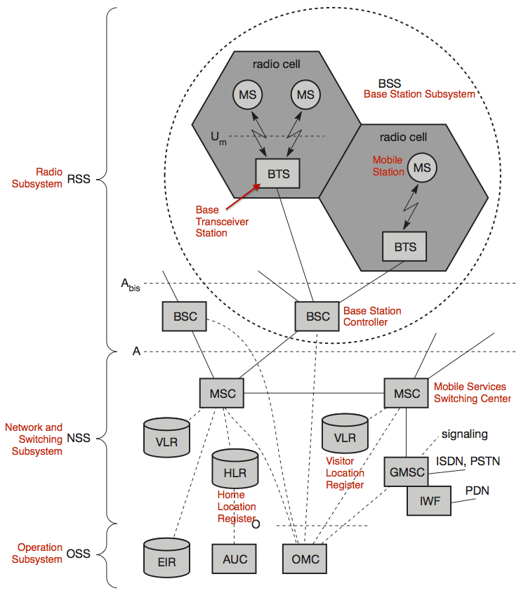

A list of GSM concepts related to the localisation of mobile phones.

Note that this applies specifically to GSM. For UMTS and LTE most concepts are similar, but the terminology is often different.

# Contents

-  toc
{:toc .toc-depth-1 .toc-skip-first}

# Acronyms

| |
|:-|:-
| GSM | Global System for Mobile Communication (2G)
| UMTS | Universal Mobile Telecommunication System (3G)
| LTE | Long Term Evolution (4G)
| MS | Mobile Station
| BTS | Base Transceiver Station (called Node B in UMTS and eNodeB in LTE)
| MCC | Mobile Country Code
| MNC | Mobile Network Code
| LAC | Location Area Code
| LAI | Location Area Identifier
| CID | Cell ID
| GCID | Global Cell ID
{:.table-acronym}

# MCC

**Mobile Country Code**

Country identifier.

## Examples

- 228: Switzerland
- 208: France

## References

- <http://en.wikipedia.org/wiki/Mobile_country_code> 
- <http://de.wikipedia.org/wiki/Mobile_Country_Code> 

# MNC

**Mobile Network Code**

Identifier of an operator inside a country.

## Examples

In Switzerland:

- 01: Swisscom
- 02: Sunrise
- 03: Orange

In France:

- 01: Orange
- 02: Orange
- 10: SFR
- 13: SFR
- 15: Free Mobile
- 20: Bouygues Telecom
- 88: Bouygues Telecom

## References

- <http://de.wikipedia.org/wiki/Mobile_Network_Code> 
- <http://fr.wikipedia.org/wiki/Mobile_Network_Code> 

# LAC

**Location Area Code**

Identifier of a Location Area (LA) inside an operator's network inside a country. A location area consists of a number of Base Transceiver Stations (BTS). The LAC is a 16-bit number, thus there are 65536 possible location areas per operator per country.

The geographical sizes of different location areas, as well as the number of BTS they contain, may be very different, based on user density, etc.

## References

- <http://de.wikipedia.org/wiki/Location_Area> 
- <http://en.wikipedia.org/wiki/Mobility_management#Location_area> 

# LAI

**Location Area Identifier**

MCC + MNC + LAC

Globally unique identifier of a location area. Broadcast regularly by the BTS of a location area.

## References

- <http://en.wikipedia.org/wiki/Location_area_identity> 

# CID

**Cell ID**

Identifier of a BTS within a location area. In the case of directional antennas, the CID may identify one of the two or three sectors of the antenna (see references for details). The CID is a 16-bit number (GSM) or 28-bit number (UMTS).

## References

- <http://de.wikipedia.org/wiki/Cell-ID> 
- <http://en.wikipedia.org/wiki/Cell_ID> 

# GCID

**Global Cell ID**

MCC + MNC + LAC + CID

Globally unique identifier of a BTS.

## References

- <http://de.wikipedia.org/wiki/Cell-ID> 

# Public Cell ID Location Databases

There is a number of services for getting the geographical location of a BTS given its GCID:

- [OpenCellID](http://opencellid.org/)
    - Around 80'000 cells in Switzerland
    - RESTful HTTP API, but access is restricted, if one does not also contribute to the DB
    - However, entire DB can be downloaded freely as a CSV file
- [Mozilla Location Service](https://location.services.mozilla.com/)
    - Contains apparently a subset of the OpenCellID data
- The unofficial Google API at <http://google.com/glm/mmap>
- [Google Maps Geolocation API](https://developers.google.com/maps/documentation/business/geolocation/)
    - Restricted number of queries to the HTTP API for free, otherwise paid license necessary
- Furthers are listed [here](http://en.wikipedia.org/wiki/Cell_ID#Public_Cell_ID_databases)

# Location Update Procedure

Procedure in which a mobile station (MS) informs the network about its current location area, i.e. communicates its current LAC to the network. There are the following reasons for a location update:

- Periodical location update (at a fixed time interval)
- When a MS changes from one location area to another (MS has to detect this change, based on LAI broadcast by BTS)
- When a MS is switched on

The current LAC of a MS is stored in the Home Location Register (HLR) and Visitor Location Register (VLR) of the network.

## References

- <http://en.wikipedia.org/wiki/Mobility_management#Location_update_procedure> 
- <http://de.wikipedia.org/wiki/Location_Update> 

# Paging

Localisation of a MS for a Mobile Terminated Call (MTC), that is, the delivery of a call or SMS to a MS. The network permanently knows in which location area a specific MS is, but not which BTS it is connected to. To deliver a call or SMS, the network broadcasts a request over all BTS of the corresponding location area. This is called paging. If the MS answers, the network knows the active BTS (the MS's CID), and can establish a connection.

## References

- <http://de.wikipedia.org/wiki/Location_Area#Ortung_im_Mobilfunknetz> 
- <http://de.wikipedia.org/wiki/Mobile_Terminated_Call> 

# Localisation of Mobile Stations

There are different scenarios for localising a MS:

- Network operator wants to localise a MS
- MS wants to localise itself
- A third party having some information about a MS wants to localise it

The simplest way, which works for all three scenarios, is to take the current CID of the MS and find out the location of the corresponding BTS (see Public Cell ID Location Databases above). In order for the network operator to know the current CID, the MS has to respond to a paging request (in UMTS this can be done easily with data traffic, so that the user of the MS doesn't notice anything). The MS itself knows its CID at any time.

There are many more sophisticated methods (network-based and MS-based), see references.

## References

- <http://de.wikipedia.org/wiki/GSM-Ortung> 
- <http://en.wikipedia.org/wiki/Mobile_phone_tracking> 

# GSM Architecture

{:width="100%"}
*Source: Jochen Schiller. Mobile Communications. Second Edition. Addison-Wesley, 2003 (p. 101)*{:.caption}
