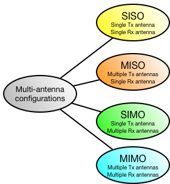
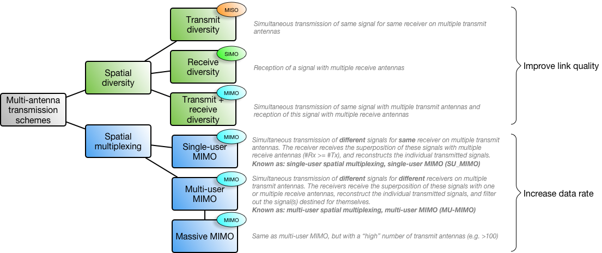

Multi-antenna transmission is the transmission (or reception) with multiple antennas at the same time at the same frequency.

# Multi-Antenna Configurations

The multiple antennas can be located at the transmitter and/or the receiver end. From this, the following combinations emerge (note that SISO is not a multi-antenna configuration, but just here for completeness):

[PDF version](assets/multi-antenna_configurations.pdf)

{:width="40%"}{:.center-image}

In general, multi-antenna configurations allow to achieve the following techniques:

-   Spatial Diversity
-   Spatial multiplexing
-   Beamforming

In particular, the individual configurations allow to achieve the following:

-   SIMO
    -   Receive diversity
    -   Receiver beamforming
-   MISO
    -   Transmit diversity
    -   Transmitter beamforming
-   MIMO
    -   Transmit + receive diversity
    -   Receiver + transmitter beamforming
    -   Spatial multiplexing

# Multi-Antenna Transmission Schemes

Multi-antenna transmission can be used for different ends:

1. Improving the **quality** of a link (send same amount of data per time, but decrease error rate)
2. Increasing the **data rate** of a link (send more data in the same amount of time)

The first end, improving link quality, can be achieved with **spatial diversity**. This means that the **same signal** is sent and/or received at the same time with the same frequency with multiple antennas. The increase in link quality is facilitated by the slightly different spatial locations of the individual antennas. This results in different channel conditions between any pair of transmit and receive antennas, which can be exploited to recover a better signal at the receiver end.

The second end, increasing link data rate, can be achieved with **spatial multiplexing**. This means that **different signals** are sent at the same time with the same frequency with multiple antennas. This requires that the receiver also has multiple antennas, in order to receive all of the individual signals (thus, all spatial multiplexing schemes use the MIMO antenna configuration). This requires the different signals to be sent in a certain manner that allows the receiver to reconstruct the individual signals from the received supersposition of all signals.

Below, the different spatial diversity and multiplexing schemes are illustrated:

[PDF version](assets/multi-antenna_schemes.pdf)

{:width="100%"}

Multi-antenna techniques
========================

Multiple antennas at transmitter and/or receiver.

