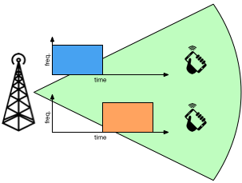
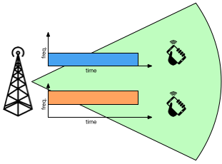
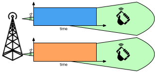

Multiplexing is the transmission of different signals on the same transmission medium by avoiding that these signals interfer with each other.

This is possible by sharing some of the resources of the transmission medium, and dividing at least one of them.

The main resources of the transmission medium of radio communication (the air) are the following:

- **Time** at which a signal is transmitted
- **Frequency** on which a signal is transmitted
- **Space** to which a signal is transmitted

This gives rise to the following multiplexing schemes.

# Time-Divison Multiplexing

Send different signals with the **same frequency** in the **same space**, but at **different times**.

{:width="50%"}{:.center-image}

The time intervals during which each signal is sent must not overlap.

The frequency and space resources are shared, and the time resource is divided.

# Frequency-Divison Multiplexing

Send different signals at the **same time** in the **same space**, but to **different frequencies**.

{:width="50%"}{:.center-image}

The frequency ranges on which each signal is sent must not overlap.

The time and space resources are shared, and the frequency resource is divided.

# Space-Divison Multiplexing

Send different signals at the **same time** with the **same frequency**, but in **different spatial areas**.

{:width="50%"}{:.center-image}

The spatial areas at which each signal can be received must not overlap.

The time and frequency resources are shared, and the space resource is divided.
