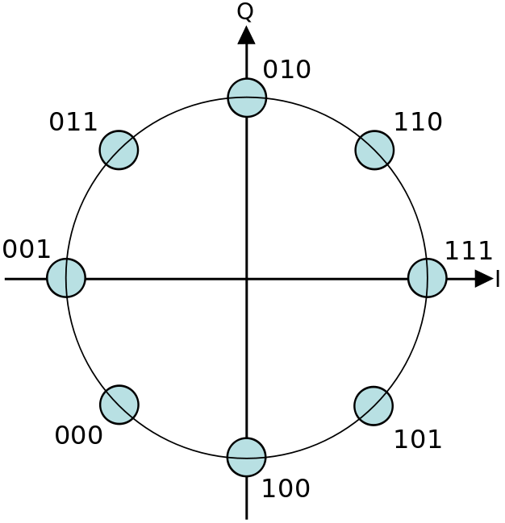
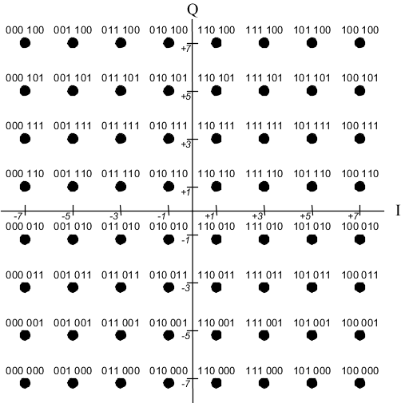
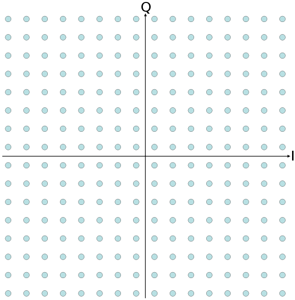

Illustration of the different types of Phase-Shift Keying Modulation (PSK) and Quadrature Amplitude Modulation (QAM) schemes.

PSK Modulation Schemes
===========================================

The distinct states of the output signal are achieved by varying the
**phase** of the carrier signal.

Binary PSK (BPSK)
--------------------------------

-   Other names:
    -   2-PSK
-   2 distinct phases $\rightarrow$ 2 symbols $\rightarrow$ 1
    bit/symbol
    .png){:width="40%"}{:.center-image}

Quadrature PSK (QPSK)
------------------------------------

-   Other names:
    -   4-PSK
    -   4-QAM
-   4 distinct phases $\rightarrow$ 4 symbols $\rightarrow$ 2
    bits/symbol
    .png){:width="40%"}{:.center-image}
-   4-PSK and 4-QAM are based on different concepts, however, they
    result in the same modulated signal.
-   **Used in LTE**

8-PSK
-----

-   8 distinct phases $\rightarrow$ 8 symbols $\rightarrow$ 3
    bits/symbol
    {:width="40%"}{:.center-image}
-   Highest-order PSK modulation scheme that is used in practice.
    In e.g. 16-PSK, with 16 distinct phases, the error rate would be
    too high. If a higher bits/symbol rate is needed, then another
    modulation scheme (such as QAM) is used.

QAM Modulation Schemes
=============================================

Combination of phase-shift keying (PSK) and amplitude-shift keying
(ASK). The distinct states of the ouptut signal are achieved by the
combinations of a number of distinct **phases** and a number of distinct
**amplitudes**.

4-QAM
-----

-   4 phases $\times$ 1 amplitude $\rightarrow$ 4 symbols
    $\rightarrow$ 2 bits/symbol
    .png){:width="40%"}{:.center-image}
-   In effect, identical to QPSK

16-QAM
------

-   E.g.: 8 phases $\times$ 2 amplitudes $\rightarrow$ 16 symbols
    $\rightarrow$ 4 bits/symbol
    {:width="40%"}{:.center-image}
-   Other combinations of phases and amplitudes are possible. There must
    be at least 16 combinations to accommodate the 16 symbols.
-   **Used in LTE**

64-QAM
------

-   E.g.: 16 phases $\times$ 4 amplitudes $\rightarrow$ 64 symbols
    $\rightarrow$ 6 bits/symbol
    {:width="40%"}{:.center-image}
-   Other combinations of phases and amplitudes are possible. There must
    be at least 64 combinations to accommodate the 64 symbols.
-   **Used in LTE**

256-QAM
-------

-   E.g.: 32 phases $\times$ 8 amplitudes $\rightarrow$ 256 symbols
    $\rightarrow$ 8 bits/symbol
    {:width="40%"}{:.center-image}
-   Other combinations of phases and amplitudes are possible. There must
    be at least 256 combinations to accommodate the 256 symbols.

# References

- <https://en.wikipedia.org/wiki/Phase-shift_keying>
- <https://en.wikipedia.org/wiki/Quadrature_amplitude_modulation>
