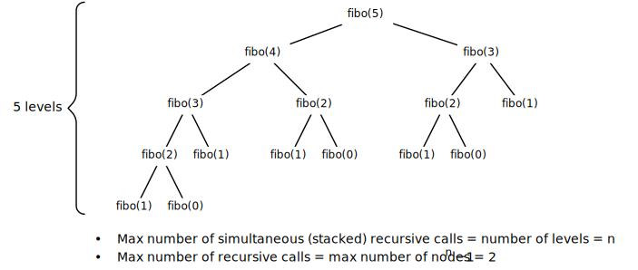

$$
\newcommand{\O}{\text{O}}
$$

Summary of the notions of recursion and dynamic programming with examples.

# Contents

- TOC
{:toc .toc-skip-first .toc-depth-1}

# Introduction

**Recursion:** repeated application of the same procedure on subproblems of the same type of a problem.

**Dynamic programming:** caching the results of the subproblems of a problem, so that every subproblem is solved only once. 

## Recursion vs. Dynamic Programming

Recursion risks to solve identical subproblems multiple times. This inefficiency is addressed and remedied by dynamic programming.

## Recursion vs. Iteration

With respect to iteration, recursion has the following advantages and disadvantages:

- Simplicity: often a recursive algorithm is simple and elegant compared to an iterative algorithm
- Space-inefficiency: every recursive call adds a layer to the system's call stack. If the number of stacked recursive calls gets too large, the result is a *stack overflow* (e.g. `StackOverflowError`in Java ). 

Every recursive algorithm can be implemented iteratively.

# Divide and Conquer

Recursion and dynamic programming are forms of divide and conquer, that is dividing a problem into subproblems and assembling the solution of the problems from the solutions of the subproblems.

There are different approaches to divide and conquer.

## Bottom-Up

- Start at a base case that can be trivially solved
    - For example, $n = 0$
- From the solution of one case, construct the solution of the subsequent case
    - For example, solve $n = 1$ from the solution of $n=0$

## Top-Down

- Divide the problem into a "large" and "small" subproblem
    - The small subproblem can be trivially solved
    - The large subproblem can be recursively solved
- Compare with recursive definition of a list: a list is either empty, or an element (the "head") and another list (the "tail")

# Fibonacci Iterative

~~~java
int fibo(int n) {
    if (n == 0) return 0;
    if (n == 1) return 1;
    int x = 0;
    int y = 1; 
    for (int i = 2; i < n; i++) {
        int tmp = x + y;
        x = y;
        y = tmp;
    }
    return x + y;
}
~~~

## Time Complexity

There are $n-2$ iterations, therefore the time complexity is $\O(n)$.

## Space Complexity

There is only a constant amount of variables and no recursive calls, therefore the space complexity is $\O(1)$.

# Fibonacci Recursive

~~~java
int fibo(int n) {
    if (n == 0) return 0;
    if (n == 1) return 1;
    return fibo(n-1) + fibo(n-2);
}
~~~

## Recursive Call Tree

Example for $n = 5$:

{:width="100%"}{:.center-image}

## Time Complexity

Since the `fibo` method does only a constant amount of work, the time complexity is proportional to the number of calls to `fibo`, that is the number of nodes in the recursive call tree.

The recursive call tree is a binary tree, and for `fibo(n)` it has $n$ levels. Therefore, the maximum number of nodes in this tree is $2^n - 1$. The time complexity is thus $\O(2^n)$.

## Space Complexity

The `fibo` method requires just a constant amount of memory, but each recursive call adds a frame to the system's call stack. Thus the algorithm uses space proportional to the maximum number of `fibo` frames that can be simultaneously on the call stack. This equals the number of levels of the recursive call tree.

For `fibo(n)`, the number of levels of the recursive call tree is $n$. Thus, the space complexity of the algorithm is $\O(n)$.

# Fibonacci Top-Down Dynamic Programming (Memoisation)

This is similar to the [recursive solution](#fibonacci-recursive) but using a "memo" for caching the result of `fibo(n)` when it is called for the first time.

~~~java
int fibo(int n) {
    return fiboRec(n, new int[n+1]);
}

int fiboRec(int n, int[] memo) {
    if (n == 0) return 0;
    if (n == 1) return 1;
    if (memo[n] == 0) memo[n] = fiboRec(n-1, memo) + fiboRec(n-2, memo);
    return memo[n];
}
~~~

## Recursive Call Tree

Example for $n=5$:

{:width="70%"}{:.center-image}

Recursive calls that return their result immediately are shaded in gray.

As can be seen, subtrees that correspond to subproblems that have already been solved are pruned from this recursive call tree.

## Time Complexity

As for the [recursive solution](#fibonacci-recursive), the time complexity is the number of nodes in the recursive call tree. How many nodes are there in the tree?

There are $n-1$ non-immediately returning calls to `fibo`, and each of the corresponding nodes has another child that returns immediately. Plus the node for $n=2$ has one additional child that returns immediately (one of the base cases). Thus, there are $2(n-1) + 1 = 2n-1$ nodes in the tree. The time complexity is thus $\O(n)$.

## Space Complexity

As for the [recursive solution](#fibonacci-recursive), the space complexity is the number of levels of the recursive call tree, which is $n$. Thus, the space complexity is $\O(n)$.

# Fibonacci Bottom-Up Dynamic Programming

This is esentially the same as the [iterative solution](#fibonacci-iterative).

# The Power of Recursion

The [Towers of Hanoi](https://en.wikipedia.org/wiki/Tower_of_Hanoi) problem consists in moving all the disks from the first tower to the last tower in the same order, under the following constraints:

1. Only one disk can be moved at a time
2. A disk cannot be placed on top of a smaller disk

The recursive solution is extremely easy, for example, in Java:

~~~java
void hanoi(int n, Stack<Integer> start, Stack<Integer> tmp, Stack<Integer> dest) {
    if (n <= 0) return;              // Base case, no disks to move
    hanoi(n-1, start, dest, tmp);    // Move disks on top of largest disk to "tmp"
    dest.push(start.pop());          // Move largest disk to "dest"
    hanoi(n-1, tmp, start, dest);    // Move disks on "tmp" to "dest"
}
~~~

These are 4 lines of code doing the following (example of *n* = 6 disks):

{:.center-image}{:width="40%"}
*Source:&nbsp;[Wikipedia](https://commons.wikimedia.org/wiki/File:Iterative_algorithm_solving_a_6_disks_Tower_of_Hanoi.gif#/media/File:Iterative_algorithm_solving_a_6_disks_Tower_of_Hanoi.gif)*{:.caption}

There are $2^n-1$ moves.

Good luck implementing this iteratively!
