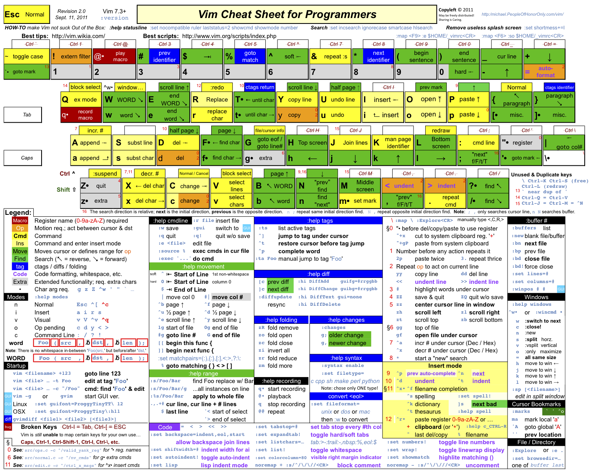

# Graphical Vim Cheatsheet

This cheatsheet by the creator of [ViEmu](http://www.viemu.com/) can be found [here](http://www.viemu.com/a_vi_vim_graphical_cheat_sheet_tutorial.html) (GIF and SVG version). A PDF version of the cheatsheet has been created [here](http://www.glump.net/howto/desktop/vim-graphical-cheat-sheet-and-tutorial).

Directly download the [SVG](assets/viemu-cheatsheet.svg) or [PDF](assets/viemu-cheatsheet.pdf) version.

{:width="100%"}

# Vim Cheatsheet for Programmers

This Vim cheatsheet by Michael Pohoreski is similarly designed as the [Graphical Vim Cheatsheet](#graphical-vim-cheatsheet), but seems to be a bit more extensive. It can be found [here](http://michael.peopleofhonoronly.com/vim/).

Directly download the [PDF version](assets/vim-cheatsheet-for-programmers.pdf).

{:width="100%"}

# Beautiful Vim Cheatsheet

A vim cheatsheet, created by Max Cantor, targeted to be **beautiful** and **organised** (unlike the vim user interface and most other vim cheatsheets).

The project is presented [here](https://www.kickstarter.com/projects/maxcantor/beautiful-vim-cheat-sheet-poster). It seems to be possible to buy high-resolution electronic and physical copies (posters). 

{:width="100%"}

